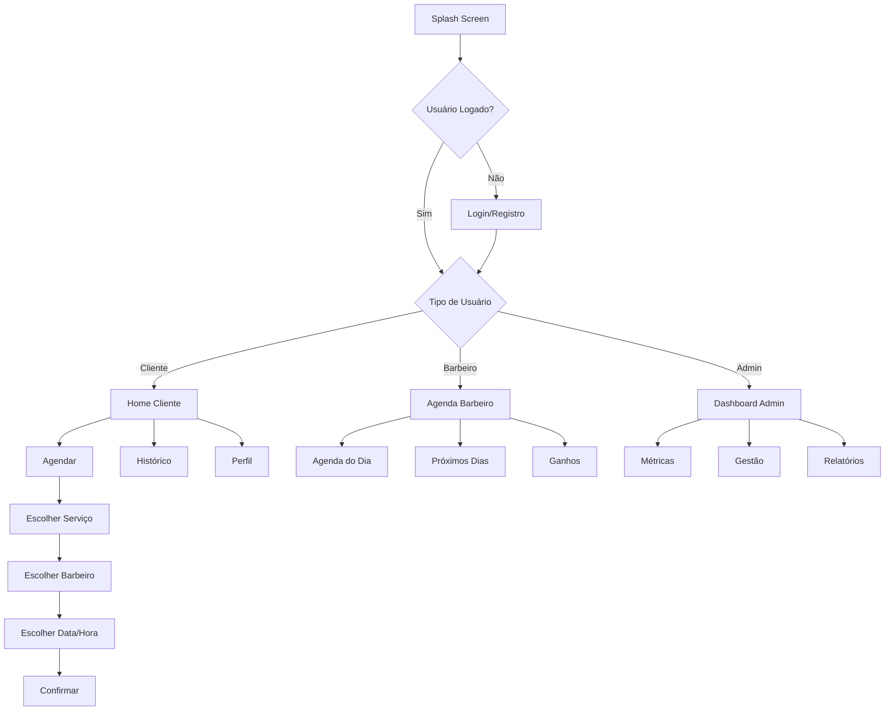

# APP PWA Reformulado - PRD Completo

## 1. Visão Geral do Produto

O APP PWA deve ser uma **solução completa mobile-first** que atende tanto clientes finais quanto donos de barbearia em uma única aplicação. Deve funcionar perfeitamente em dispositivos móveis, ser instalável como APP nativo, e oferecer todas as funcionalidades essenciais para o negócio.

**Objetivo:** Criar um APP que realmente funciona no celular, com interface intuitiva, funcionalidades completas de agendamento, e área administrativa integrada.

## 2. Arquitetura de Usuários

### 2.1 Tipos de Usuário

| Tipo | Registro | Funcionalidades Principais |
|------|----------|---------------------------|
| **Cliente** | Email/WhatsApp | Agendar, ver histórico, avaliar, pagar |
| **Barbeiro** | Convite do admin | Gerenciar agenda, atender clientes, ver ganhos |
| **Administrador** | Proprietário | Gestão completa, relatórios, configurações |

## 3. Funcionalidades por Área

### 3.1 ÁREA DO CLIENTE

#### 3.1.1 Páginas Principais
1. **Home/Dashboard**: Próximos agendamentos, promoções, acesso rápido
2. **Agendar**: Fluxo completo de agendamento
3. **Histórico**: Agendamentos passados e avaliações
4. **Perfil**: Dados pessoais e preferências
5. **Produtos**: Catálogo de produtos da barbearia

#### 3.1.2 Fluxo de Agendamento (Mobile-First)

| Etapa | Tela | Funcionalidade |
|-------|------|----------------|
| 1 | Selecionar Barbearia | Lista com barbearias próximas (se multi-tenant) |
| 2 | Escolher Serviço | Grid visual com serviços, preços e duração |
| 3 | Escolher Barbeiro | Cards com foto, especialidades e avaliações |
| 4 | Escolher Data | Calendário mobile com disponibilidade |
| 5 | Escolher Horário | Slots disponíveis em formato mobile |
| 6 | Dados do Cliente | Formulário otimizado para mobile |
| 7 | Confirmação | Resumo + opções de pagamento |
| 8 | Sucesso | Confirmação + botão WhatsApp |

#### 3.1.3 Interface Mobile-First

**Design Principles:**
- **Touch-friendly**: Botões grandes (min 44px)
- **Thumb navigation**: Navegação na parte inferior
- **Swipe gestures**: Navegação por gestos
- **Loading states**: Feedback visual em todas as ações
- **Offline support**: Funciona sem internet

### 3.2 ÁREA DO BARBEIRO

#### 3.2.1 Páginas Principais
1. **Agenda do Dia**: Lista de clientes e horários
2. **Próximos Dias**: Visão semanal da agenda
3. **Histórico**: Atendimentos realizados
4. **Ganhos**: Comissões e pagamentos
5. **Perfil**: Dados profissionais e especialidades

#### 3.2.2 Funcionalidades Específicas
- **Check-in de clientes**: Marcar chegada do cliente
- **Iniciar/Finalizar atendimento**: Controle de tempo
- **Adicionar observações**: Notas sobre o cliente
- **Gerenciar disponibilidade**: Bloquear/liberar horários

### 3.3 ÁREA DO ADMINISTRADOR

#### 3.3.1 Dashboard Principal
- **Métricas em tempo real**: Agendamentos hoje, receita, ocupação
- **Gráficos de performance**: Receita mensal, barbeiros top
- **Alertas importantes**: Cancelamentos, problemas
- **Ações rápidas**: Novo agendamento, novo barbeiro

#### 3.3.2 Gestão Completa

| Módulo | Funcionalidades |
|--------|----------------|
| **Barbeiros** | Cadastro, horários, comissões, performance |
| **Serviços** | Catálogo, preços, duração, categorias |
| **Produtos** | Estoque, vendas, fornecedores |
| **Clientes** | Base de dados, histórico, preferências |
| **Agenda** | Visão geral, bloqueios, feriados |
| **Financeiro** | Receitas, despesas, relatórios |
| **Integrações** | WhatsApp, Google, N8N, IA |

## 4. Integrações Funcionais

### 4.1 Google Calendar
```typescript
// Sincronização bidirecional
interface GoogleCalendarIntegration {
  syncAppointments(): Promise<void>;
  createEvent(appointment: Appointment): Promise<string>;
  updateEvent(eventId: string, changes: Partial<Appointment>): Promise<void>;
  deleteEvent(eventId: string): Promise<void>;
}
```

### 4.2 WhatsApp Business API
```typescript
// Automação de mensagens
interface WhatsAppIntegration {
  sendConfirmation(phone: string, appointment: Appointment): Promise<void>;
  sendReminder(phone: string, appointment: Appointment): Promise<void>;
  sendFeedbackRequest(phone: string, appointment: Appointment): Promise<void>;
  handleIncomingMessage(message: WhatsAppMessage): Promise<void>;
}
```

### 4.3 N8N Workflows
- **Novo cliente**: Adicionar ao CRM, enviar boas-vindas
- **Agendamento confirmado**: Notificar barbeiro, bloquear agenda
- **Atendimento finalizado**: Solicitar avaliação, atualizar histórico
- **Cliente inativo**: Campanha de reativação

### 4.4 Agentes de IA
- **Chatbot 24/7**: Atendimento automático via WhatsApp
- **Recomendações**: Sugestão de serviços baseada no histórico
- **Otimização de agenda**: IA sugere melhor distribuição de horários
- **Análise de sentimento**: Monitora satisfação dos clientes

## 5. Design System Mobile-First

### 5.1 Componentes Base
```typescript
// Componentes otimizados para mobile
interface MobileComponents {
  BottomNavigation: React.FC<{tabs: Tab[]}>;
  SwipeableCard: React.FC<{children: React.ReactNode}>;
  TouchableButton: React.FC<{size: 'small' | 'medium' | 'large'}>;
  MobileCalendar: React.FC<{onDateSelect: (date: Date) => void}>;
  TimeSlotPicker: React.FC<{slots: TimeSlot[]}>;
  PullToRefresh: React.FC<{onRefresh: () => Promise<void>}>;
}
```

### 5.2 Paleta de Cores
- **Primary**: #1a1a1a (Preto elegante)
- **Secondary**: #FFD700 (Dourado premium)
- **Success**: #10B981 (Verde confirmação)
- **Warning**: #F59E0B (Laranja alerta)
- **Error**: #EF4444 (Vermelho erro)
- **Background**: #FAFAFA (Cinza claro)

### 5.3 Tipografia Mobile
- **Heading**: 24px/28px (Títulos principais)
- **Subheading**: 18px/22px (Subtítulos)
- **Body**: 16px/20px (Texto principal)
- **Caption**: 14px/18px (Textos secundários)
- **Button**: 16px/20px (Textos de botão)

## 6. Funcionalidades PWA Essenciais

### 6.1 Manifest.json Otimizado
```json
{
  "name": "Barbearia Pro",
  "short_name": "BarbPro",
  "description": "Agendamento de barbearia profissional",
  "start_url": "/",
  "display": "standalone",
  "orientation": "portrait",
  "theme_color": "#1a1a1a",
  "background_color": "#FAFAFA",
  "icons": [
    {
      "src": "/icons/icon-192.png",
      "sizes": "192x192",
      "type": "image/png",
      "purpose": "any maskable"
    },
    {
      "src": "/icons/icon-512.png",
      "sizes": "512x512",
      "type": "image/png",
      "purpose": "any maskable"
    }
  ]
}
```

### 6.2 Service Worker Avançado
- **Cache Strategy**: Network-first para dados dinâmicos, Cache-first para assets
- **Offline Support**: Funcionalidades básicas funcionam offline
- **Background Sync**: Sincroniza dados quando volta online
- **Push Notifications**: Lembretes de agendamento

### 6.3 Instalação Nativa
- **Add to Home Screen**: Prompt automático após 3 visitas
- **App-like Experience**: Sem barra de endereço, splash screen
- **Deep Linking**: URLs específicas para cada funcionalidade

## 7. Fluxo de Navegação Mobile



## 8. Performance e Otimização

### 8.1 Métricas Alvo
- **First Contentful Paint**: < 1.5s
- **Largest Contentful Paint**: < 2.5s
- **Cumulative Layout Shift**: < 0.1
- **First Input Delay**: < 100ms
- **Time to Interactive**: < 3s

### 8.2 Estratégias de Otimização
- **Code Splitting**: Carregamento lazy por rota
- **Image Optimization**: WebP, lazy loading, responsive images
- **Bundle Size**: < 200KB inicial, < 1MB total
- **Caching**: Estratégia agressiva para assets estáticos
- **Compression**: Gzip/Brotli para todos os assets

## 9. Testes e Validação

### 9.1 Testes Mobile
- **Responsividade**: Teste em diferentes tamanhos de tela
- **Touch Interactions**: Gestos e toques funcionam corretamente
- **Performance**: Teste em dispositivos de baixo desempenho
- **Conectividade**: Teste com conexão lenta/instável

### 9.2 Testes de Funcionalidade
- **Fluxo de agendamento**: Teste completo end-to-end
- **Integrações**: WhatsApp, Google Calendar funcionando
- **Notificações**: Push notifications e lembretes
- **Offline**: Funcionalidades básicas sem internet

## 10. Roadmap de Implementação

### Fase 1 (Semana 1-2): Base Mobile
- ✅ Setup PWA com manifest e service worker
- ✅ Design system mobile-first
- ✅ Navegação bottom tabs
- ✅ Autenticação mobile-friendly

### Fase 2 (Semana 3-4): Funcionalidades Core
- ✅ Fluxo de agendamento mobile
- ✅ Dashboard cliente/barbeiro/admin
- ✅ Gestão de serviços e barbeiros
- ✅ Sistema de notificações

### Fase 3 (Semana 5-6): Integrações
- ✅ WhatsApp Business API
- ✅ Google Calendar sync
- ✅ N8N workflows
- ✅ Agentes de IA básicos

### Fase 4 (Semana 7-8): Polimento
- ✅ Otimização de performance
- ✅ Testes extensivos
- ✅ Ajustes de UX
- ✅ Deploy e monitoramento