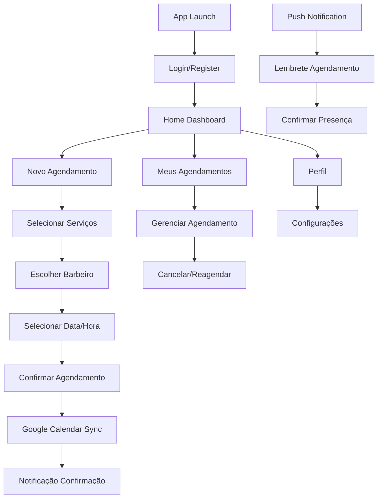

# App PWA Barbearia - Documento de Requisitos

## 1. Product Overview

Aplicativo Progressive Web App (PWA) para clientes de barbearias que permite agendamento de serviços, gestão de perfil e comunicação direta com a barbearia. O app oferece experiência nativa com funcionalidades offline, notificações push e integração com Google Calendar e WhatsApp.

O app resolve problemas de agendamento por telefone, falta de lembretes e dificuldade de reagendamento. Destinado aos clientes da barbearia, oferece conveniência e autonomia para gerenciar seus agendamentos a qualquer momento.

## 2. Core Features

### 2.1 User Roles

| Role | Registration Method | Core Permissions |
|------|---------------------|------------------|
| Cliente | Registro via WhatsApp ou email | Agendar serviços, gerenciar perfil, receber notificações, avaliar serviços |
| Cliente Premium | Upgrade via assinatura | Agendamento prioritário, descontos exclusivos, cancelamento flexível |

### 2.2 Feature Module

Nosso app PWA consiste nas seguintes telas principais:

1. **Onboarding**: apresentação do app, tutorial de uso, solicitação de permissões
2. **Login/Registro**: autenticação via email/WhatsApp, recuperação de senha
3. **Home Dashboard**: visão geral dos agendamentos, notificações, acesso rápido
4. **Agendamento**: seleção de serviços, escolha de barbeiro, calendário, confirmação
5. **Meus Agendamentos**: lista de agendamentos futuros e passados, opções de gestão
6. **Perfil**: dados pessoais, preferências, configurações de notificação
7. **Histórico**: serviços realizados, avaliações, estatísticas pessoais
8. **Notificações**: central de mensagens, lembretes, promoções
9. **Configurações**: preferências do app, conta, privacidade

### 2.3 Page Details

| Page Name | Module Name | Feature description |
|-----------|-------------|---------------------|
| Onboarding | Introdução | Apresentar benefícios do app, solicitar permissões de notificação e localização |
| Onboarding | Tutorial | Guiar usuário pelas principais funcionalidades com slides interativos |
| Login/Registro | Autenticação | Login via email/senha, registro com dados básicos, integração WhatsApp |
| Login/Registro | Recuperação | Reset de senha via email, validação por SMS |
| Home Dashboard | Resumo | Mostrar próximo agendamento, notificações recentes, atalhos rápidos |
| Home Dashboard | Ações Rápidas | Botões para novo agendamento, contato WhatsApp, emergência |
| Agendamento | Seleção Serviços | Grid de serviços com preços, duração, descrição, múltipla seleção |
| Agendamento | Escolha Barbeiro | Lista de barbeiros com foto, especialidades, avaliações |
| Agendamento | Calendário | Visualização mensal/semanal, horários disponíveis, sincronização Google |
| Agendamento | Confirmação | Resumo do agendamento, forma de pagamento, observações especiais |
| Meus Agendamentos | Lista Futuros | Agendamentos confirmados, opções cancelar/reagendar, detalhes |
| Meus Agendamentos | Gestão | Cancelamento com política, reagendamento, adição de observações |
| Perfil | Dados Pessoais | Edição de nome, telefone, WhatsApp, foto de perfil |
| Perfil | Preferências | Barbeiro favorito, tipos de serviço, horários preferenciais |
| Histórico | Serviços Realizados | Lista cronológica, fotos antes/depois, avaliações dadas |
| Histórico | Estatísticas | Frequência de visitas, valor gasto, serviços mais utilizados |
| Notificações | Central Mensagens | Lista de notificações, filtros por tipo, ações rápidas |
| Notificações | Configurações | Tipos de notificação, horários permitidos, canais preferidos |
| Configurações | App | Tema escuro/claro, idioma, cache, dados offline |
| Configurações | Conta | Alterar senha, excluir conta, exportar dados |

## 3. Core Process

**Fluxo de Agendamento:**
1. Cliente abre o app e faz login
2. Acessa seção de agendamento
3. Seleciona serviços desejados
4. Escolhe barbeiro de preferência
5. Visualiza calendário e seleciona horário
6. Confirma agendamento e forma de pagamento
7. Recebe confirmação e evento é criado no Google Calendar
8. Recebe notificações de lembrete

**Fluxo de Notificações:**
1. Sistema detecta agendamento próximo (24h antes)
2. Envia notificação push para o cliente
3. Cliente pode confirmar presença ou reagendar
4. Barbeiro recebe confirmação
5. Sistema envia lembrete final (2h antes)



## 4. User Interface Design

### 4.1 Design Style

- **Cores Primárias**: #1a1a1a (preto), #d4af37 (dourado), #ffffff (branco)
- **Cores Secundárias**: #2d2d2d (cinza escuro), #f8f9fa (cinza claro), #28a745 (verde sucesso)
- **Estilo de Botões**: Material Design, bordas arredondadas 12px, elevação sutil
- **Fontes**: Roboto (sistema), tamanhos 14px-24px, peso 400-700
- **Layout**: Bottom navigation, cards com sombra, FAB para ação principal
- **Ícones**: Material Icons, outline style, cores consistentes

### 4.2 Page Design Overview

| Page Name | Module Name | UI Elements |
|-----------|-------------|-------------|
| Home Dashboard | Header | Avatar usuário, notificações badge, menu hamburger |
| Home Dashboard | Cards Principais | Próximo agendamento, ações rápidas, estatísticas |
| Agendamento | Stepper | Indicador de progresso horizontal, navegação entre etapas |
| Agendamento | Seleção | Cards de serviços com checkbox, preços destacados |
| Meus Agendamentos | Lista | Cards com timeline, status colorido, swipe actions |
| Perfil | Form | Inputs estilizados, upload de foto, switches para preferências |
| Notificações | Lista | Cards com ícones por tipo, timestamps, ações inline |

### 4.3 Responsiveness

App otimizado para mobile com suporte a tablets. Interface adaptativa que funciona em orientação portrait e landscape. Gestos touch intuitivos como swipe para ações, pull-to-refresh e scroll infinito. Suporte offline com sincronização automática quando conectado.

## 5. Funcionalidades PWA

### 5.1 Características PWA

- **Instalável**: Prompt de instalação, ícone na home screen, splash screen customizada
- **Offline-First**: Cache de dados essenciais, sincronização em background
- **Push Notifications**: Lembretes de agendamento, promoções, confirmações
- **Responsivo**: Adaptação automática a diferentes tamanhos de tela
- **Seguro**: HTTPS obrigatório, service workers para cache seguro

### 5.2 Service Worker

```javascript
// Estratégias de cache
- Cache First: Assets estáticos (CSS, JS, imagens)
- Network First: Dados dinâmicos (agendamentos, perfil)
- Stale While Revalidate: Dados que podem estar desatualizados
```

### 5.3 Manifest.json

```json
{
  "name": "Barbearia App",
  "short_name": "Barbearia",
  "description": "Agendamento de serviços de barbearia",
  "start_url": "/app",
  "display": "standalone",
  "theme_color": "#d4af37",
  "background_color": "#1a1a1a",
  "icons": [
    {
      "src": "/icons/icon-192.png",
      "sizes": "192x192",
      "type": "image/png"
    }
  ]
}
```