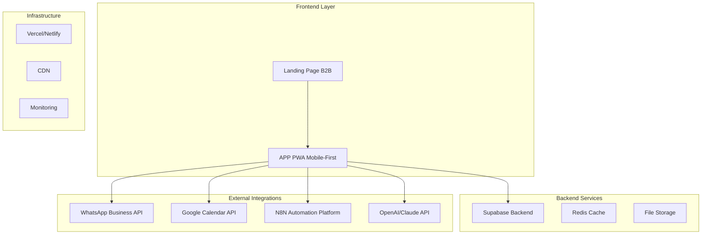

# Arquitetura Técnica Reformulada

## 1. Arquitetura Geral do Sistema



## 2. Stack Tecnológico Atualizado

### 2.1 Frontend
- **Landing Page**: React 18 + Vite + TailwindCSS + Framer Motion
- **APP PWA**: React 18 + Vite + TailwindCSS + PWA Vite Plugin
- **State Management**: Zustand + React Query
- **UI Components**: Shadcn/ui + Radix UI
- **Forms**: React Hook Form + Zod
- **Routing**: React Router v6

### 2.2 Backend & Database
- **Primary Backend**: Supabase (PostgreSQL + Auth + Storage + Edge Functions)
- **Cache**: Redis (para sessões e dados temporários)
- **File Storage**: Supabase Storage (imagens, documentos)
- **Real-time**: Supabase Realtime (notificações, updates)

### 2.3 Integrações
- **WhatsApp**: WhatsApp Business API + Webhook
- **Calendar**: Google Calendar API v3
- **Automation**: N8N (self-hosted ou cloud)
- **AI**: OpenAI GPT-4 + Claude (via API)
- **Payments**: Stripe + PIX (Brasil)
- **Maps**: Google Maps API

## 3. Estrutura de Dados Otimizada

### 3.1 Schema Principal

```sql
-- Usuários (unificado para todos os tipos)
CREATE TABLE usuarios (
    id UUID PRIMARY KEY DEFAULT gen_random_uuid(),
    email VARCHAR(255) UNIQUE NOT NULL,
    telefone VARCHAR(20),
    nome VARCHAR(100) NOT NULL,
    tipo_usuario VARCHAR(20) NOT NULL CHECK (tipo_usuario IN ('cliente', 'barbeiro', 'admin')),
    avatar_url TEXT,
    ativo BOOLEAN DEFAULT true,
    configuracoes JSONB DEFAULT '{}',
    created_at TIMESTAMP WITH TIME ZONE DEFAULT NOW(),
    updated_at TIMESTAMP WITH TIME ZONE DEFAULT NOW()
);

-- Barbearias (multi-tenant)
CREATE TABLE barbearias (
    id UUID PRIMARY KEY DEFAULT gen_random_uuid(),
    nome VARCHAR(100) NOT NULL,
    descricao TEXT,
    endereco JSONB, -- {rua, numero, bairro, cidade, cep, lat, lng}
    telefone VARCHAR(20),
    email VARCHAR(255),
    logo_url TEXT,
    configuracoes JSONB DEFAULT '{}', -- horarios, integracoes, etc
    plano VARCHAR(20) DEFAULT 'basico',
    ativo BOOLEAN DEFAULT true,
    owner_id UUID REFERENCES usuarios(id),
    created_at TIMESTAMP WITH TIME ZONE DEFAULT NOW()
);

-- Barbeiros (perfil profissional)
CREATE TABLE barbeiros (
    id UUID PRIMARY KEY DEFAULT gen_random_uuid(),
    usuario_id UUID REFERENCES usuarios(id),
    barbearia_id UUID REFERENCES barbearias(id),
    especialidades TEXT[],
    biografia TEXT,
    preco_base DECIMAL(10,2),
    comissao_percentual DECIMAL(5,2) DEFAULT 50.00,
    horario_trabalho JSONB, -- {segunda: {inicio: "09:00", fim: "18:00"}, ...}
    ativo BOOLEAN DEFAULT true,
    created_at TIMESTAMP WITH TIME ZONE DEFAULT NOW()
);

-- Serviços
CREATE TABLE servicos (
    id UUID PRIMARY KEY DEFAULT gen_random_uuid(),
    barbearia_id UUID REFERENCES barbearias(id),
    nome VARCHAR(100) NOT NULL,
    descricao TEXT,
    preco DECIMAL(10,2) NOT NULL,
    duracao_minutos INTEGER NOT NULL,
    categoria VARCHAR(50),
    imagem_url TEXT,
    ativo BOOLEAN DEFAULT true,
    created_at TIMESTAMP WITH TIME ZONE DEFAULT NOW()
);

-- Agendamentos (otimizado)
CREATE TABLE agendamentos (
    id UUID PRIMARY KEY DEFAULT gen_random_uuid(),
    barbearia_id UUID REFERENCES barbearias(id),
    cliente_id UUID REFERENCES usuarios(id),
    barbeiro_id UUID REFERENCES barbeiros(id),
    servico_id UUID REFERENCES servicos(id),
    data_hora TIMESTAMP WITH TIME ZONE NOT NULL,
    status VARCHAR(20) DEFAULT 'agendado' CHECK (status IN ('agendado', 'confirmado', 'em_andamento', 'finalizado', 'cancelado')),
    preco_total DECIMAL(10,2),
    observacoes TEXT,
    google_event_id VARCHAR(255), -- ID do evento no Google Calendar
    whatsapp_enviado BOOLEAN DEFAULT false,
    created_at TIMESTAMP WITH TIME ZONE DEFAULT NOW(),
    updated_at TIMESTAMP WITH TIME ZONE DEFAULT NOW()
);

-- Produtos (para venda)
CREATE TABLE produtos (
    id UUID PRIMARY KEY DEFAULT gen_random_uuid(),
    barbearia_id UUID REFERENCES barbearias(id),
    nome VARCHAR(100) NOT NULL,
    descricao TEXT,
    preco DECIMAL(10,2) NOT NULL,
    estoque INTEGER DEFAULT 0,
    categoria VARCHAR(50),
    imagem_url TEXT,
    ativo BOOLEAN DEFAULT true,
    created_at TIMESTAMP WITH TIME ZONE DEFAULT NOW()
);

-- Integrações (configurações por barbearia)
CREATE TABLE integracoes (
    id UUID PRIMARY KEY DEFAULT gen_random_uuid(),
    barbearia_id UUID REFERENCES barbearias(id),
    tipo VARCHAR(50) NOT NULL, -- 'whatsapp', 'google_calendar', 'n8n', 'openai'
    configuracao JSONB NOT NULL, -- credenciais e configs específicas
    ativo BOOLEAN DEFAULT true,
    created_at TIMESTAMP WITH TIME ZONE DEFAULT NOW()
);

-- Notificações
CREATE TABLE notificacoes (
    id UUID PRIMARY KEY DEFAULT gen_random_uuid(),
    usuario_id UUID REFERENCES usuarios(id),
    titulo VARCHAR(255) NOT NULL,
    mensagem TEXT NOT NULL,
    tipo VARCHAR(50), -- 'agendamento', 'lembrete', 'promocao'
    lida BOOLEAN DEFAULT false,
    data_envio TIMESTAMP WITH TIME ZONE DEFAULT NOW()
);
```

### 3.2 Índices de Performance

```sql
-- Índices para queries frequentes
CREATE INDEX idx_agendamentos_data_hora ON agendamentos(data_hora);
CREATE INDEX idx_agendamentos_barbeiro_data ON agendamentos(barbeiro_id, data_hora);
CREATE INDEX idx_agendamentos_cliente ON agendamentos(cliente_id);
CREATE INDEX idx_agendamentos_status ON agendamentos(status);
CREATE INDEX idx_usuarios_email ON usuarios(email);
CREATE INDEX idx_usuarios_tipo ON usuarios(tipo_usuario);
CREATE INDEX idx_barbeiros_barbearia ON barbeiros(barbearia_id);
CREATE INDEX idx_servicos_barbearia ON servicos(barbearia_id);
```

## 4. APIs e Endpoints

### 4.1 API Routes Structure

```typescript
// Estrutura de rotas da API
interface APIRoutes {
  // Autenticação
  '/api/auth/login': POST;
  '/api/auth/register': POST;
  '/api/auth/logout': POST;
  '/api/auth/refresh': POST;
  
  // Usuários
  '/api/users/profile': GET | PUT;
  '/api/users/preferences': GET | PUT;
  
  // Barbearias
  '/api/barbearias': GET | POST;
  '/api/barbearias/:id': GET | PUT | DELETE;
  '/api/barbearias/:id/barbeiros': GET;
  '/api/barbearias/:id/servicos': GET;
  '/api/barbearias/:id/disponibilidade': GET;
  
  // Agendamentos
  '/api/agendamentos': GET | POST;
  '/api/agendamentos/:id': GET | PUT | DELETE;
  '/api/agendamentos/:id/confirmar': POST;
  '/api/agendamentos/:id/cancelar': POST;
  
  // Integrações
  '/api/integracoes/whatsapp/webhook': POST;
  '/api/integracoes/google/calendar': GET | POST;
  '/api/integracoes/n8n/trigger': POST;
  
  // Relatórios
  '/api/relatorios/dashboard': GET;
  '/api/relatorios/financeiro': GET;
  '/api/relatorios/performance': GET;
}
```

### 4.2 Supabase Edge Functions

```typescript
// Edge Functions para lógica de negócio
interface EdgeFunctions {
  'send-whatsapp-notification': {
    input: { phone: string; message: string; template?: string };
    output: { success: boolean; messageId?: string };
  };
  
  'sync-google-calendar': {
    input: { agendamentoId: string; action: 'create' | 'update' | 'delete' };
    output: { success: boolean; eventId?: string };
  };
  
  'ai-chat-response': {
    input: { message: string; context: any };
    output: { response: string; actions?: any[] };
  };
  
  'calculate-availability': {
    input: { barbeiroId: string; date: string };
    output: { slots: TimeSlot[] };
  };
}
```

## 5. Integrações Detalhadas

### 5.1 WhatsApp Business API

```typescript
// Configuração WhatsApp
interface WhatsAppConfig {
  phoneNumberId: string;
  accessToken: string;
  webhookVerifyToken: string;
  businessAccountId: string;
}

// Templates de mensagem
interface WhatsAppTemplates {
  confirmacao_agendamento: {
    name: "confirmacao_agendamento";
    language: "pt_BR";
    components: [
      {
        type: "body";
        parameters: [
          { type: "text"; text: string }, // nome cliente
          { type: "text"; text: string }, // serviço
          { type: "text"; text: string }, // data/hora
          { type: "text"; text: string }  // barbeiro
        ];
      }
    ];
  };
  
  lembrete_agendamento: {
    name: "lembrete_agendamento";
    language: "pt_BR";
    components: [
      {
        type: "body";
        parameters: [
          { type: "text"; text: string }, // nome cliente
          { type: "text"; text: string }  // data/hora
        ];
      }
    ];
  };
}
```

### 5.2 Google Calendar Integration

```typescript
// Configuração Google Calendar
interface GoogleCalendarConfig {
  clientId: string;
  clientSecret: string;
  redirectUri: string;
  calendarId: string;
}

// Sincronização de eventos
interface CalendarEvent {
  id?: string;
  summary: string;
  description: string;
  start: { dateTime: string; timeZone: string };
  end: { dateTime: string; timeZone: string };
  attendees: Array<{ email: string; displayName: string }>;
  reminders: {
    useDefault: false;
    overrides: Array<{ method: 'email' | 'popup'; minutes: number }>;
  };
}
```

### 5.3 N8N Automation Workflows

```json
{
  "workflows": [
    {
      "name": "Novo Agendamento",
      "trigger": "webhook",
      "nodes": [
        {
          "type": "webhook",
          "name": "Trigger",
          "parameters": {
            "path": "novo-agendamento"
          }
        },
        {
          "type": "whatsapp",
          "name": "Enviar Confirmação",
          "parameters": {
            "operation": "sendTemplate",
            "template": "confirmacao_agendamento"
          }
        },
        {
          "type": "google-calendar",
          "name": "Criar Evento",
          "parameters": {
            "operation": "create",
            "calendarId": "{{$node.Trigger.json.barbearia.calendar_id}}"
          }
        }
      ]
    }
  ]
}
```

### 5.4 AI Integration

```typescript
// Configuração de IA
interface AIConfig {
  openaiApiKey: string;
  claudeApiKey: string;
  model: 'gpt-4' | 'claude-3-sonnet';
  maxTokens: number;
}

// Contexto para IA
interface AIContext {
  barbearia: {
    nome: string;
    servicos: Array<{ nome: string; preco: number; duracao: number }>;
    barbeiros: Array<{ nome: string; especialidades: string[] }>;
    horarios: any;
  };
  cliente?: {
    nome: string;
    historico: any[];
    preferencias: any;
  };
}

// Prompts do sistema
const SYSTEM_PROMPTS = {
  atendimento: `Você é um assistente virtual de uma barbearia. 
    Ajude os clientes a agendar cortes, tire dúvidas sobre serviços e preços.
    Seja sempre educado e profissional.`,
  
  recomendacao: `Baseado no histórico do cliente e suas preferências,
    recomende serviços e barbeiros adequados.`,
    
  otimizacao: `Analise a agenda e sugira otimizações para maximizar
    a ocupação e receita da barbearia.`
};
```

## 6. PWA Configuration

### 6.1 Manifest.json Completo

```json
{
  "name": "Barbearia Pro - Agendamento Profissional",
  "short_name": "BarbPro",
  "description": "Sistema completo de agendamento para barbearias",
  "start_url": "/",
  "display": "standalone",
  "orientation": "portrait-primary",
  "theme_color": "#1a1a1a",
  "background_color": "#fafafa",
  "scope": "/",
  "lang": "pt-BR",
  "categories": ["business", "lifestyle"],
  "screenshots": [
    {
      "src": "/screenshots/mobile-1.png",
      "sizes": "390x844",
      "type": "image/png",
      "form_factor": "narrow"
    }
  ],
  "icons": [
    {
      "src": "/icons/icon-72.png",
      "sizes": "72x72",
      "type": "image/png",
      "purpose": "any"
    },
    {
      "src": "/icons/icon-96.png",
      "sizes": "96x96",
      "type": "image/png",
      "purpose": "any"
    },
    {
      "src": "/icons/icon-128.png",
      "sizes": "128x128",
      "type": "image/png",
      "purpose": "any"
    },
    {
      "src": "/icons/icon-144.png",
      "sizes": "144x144",
      "type": "image/png",
      "purpose": "any"
    },
    {
      "src": "/icons/icon-152.png",
      "sizes": "152x152",
      "type": "image/png",
      "purpose": "any"
    },
    {
      "src": "/icons/icon-192.png",
      "sizes": "192x192",
      "type": "image/png",
      "purpose": "any maskable"
    },
    {
      "src": "/icons/icon-384.png",
      "sizes": "384x384",
      "type": "image/png",
      "purpose": "any"
    },
    {
      "src": "/icons/icon-512.png",
      "sizes": "512x512",
      "type": "image/png",
      "purpose": "any maskable"
    }
  ],
  "shortcuts": [
    {
      "name": "Agendar Corte",
      "short_name": "Agendar",
      "description": "Agendar um novo corte rapidamente",
      "url": "/agendar",
      "icons": [
        {
          "src": "/icons/shortcut-agendar.png",
          "sizes": "96x96"
        }
      ]
    },
    {
      "name": "Meus Agendamentos",
      "short_name": "Histórico",
      "description": "Ver agendamentos passados e futuros",
      "url": "/historico",
      "icons": [
        {
          "src": "/icons/shortcut-historico.png",
          "sizes": "96x96"
        }
      ]
    }
  ]
}
```

### 6.2 Service Worker Avançado

```typescript
// Service Worker com estratégias de cache
const CACHE_NAME = 'barbearia-pro-v1';
const STATIC_CACHE = 'static-v1';
const DYNAMIC_CACHE = 'dynamic-v1';

// Estratégias de cache
const cacheStrategies = {
  // Network First (dados dinâmicos)
  networkFirst: [
    '/api/agendamentos',
    '/api/usuarios',
    '/api/barbearias'
  ],
  
  // Cache First (assets estáticos)
  cacheFirst: [
    '/icons/',
    '/images/',
    '/_app/',
    '/fonts/'
  ],
  
  // Stale While Revalidate (dados semi-estáticos)
  staleWhileRevalidate: [
    '/api/servicos',
    '/api/barbeiros'
  ]
};

// Background sync para ações offline
self.addEventListener('sync', event => {
  if (event.tag === 'background-sync-agendamento') {
    event.waitUntil(syncAgendamentos());
  }
});

// Push notifications
self.addEventListener('push', event => {
  const options = {
    body: event.data.text(),
    icon: '/icons/icon-192.png',
    badge: '/icons/badge.png',
    vibrate: [100, 50, 100],
    data: {
      dateOfArrival: Date.now(),
      primaryKey: 1
    },
    actions: [
      {
        action: 'explore',
        title: 'Ver Agendamento',
        icon: '/icons/checkmark.png'
      },
      {
        action: 'close',
        title: 'Fechar',
        icon: '/icons/xmark.png'
      }
    ]
  };
  
  event.waitUntil(
    self.registration.showNotification('Barbearia Pro', options)
  );
});
```

## 7. Performance e Monitoramento

### 7.1 Métricas de Performance

```typescript
// Configuração de monitoramento
interface PerformanceConfig {
  // Core Web Vitals
  fcp: { target: 1500; warning: 2000 }; // First Contentful Paint
  lcp: { target: 2500; warning: 4000 }; // Largest Contentful Paint
  fid: { target: 100; warning: 300 };   // First Input Delay
  cls: { target: 0.1; warning: 0.25 };  // Cumulative Layout Shift
  
  // Custom metrics
  tti: { target: 3000; warning: 5000 }; // Time to Interactive
  tbt: { target: 200; warning: 600 };   // Total Blocking Time
}

// Analytics events
interface AnalyticsEvents {
  'agendamento_iniciado': { barbearia_id: string };
  'agendamento_concluido': { barbearia_id: string; valor: number };
  'agendamento_cancelado': { barbearia_id: string; motivo: string };
  'whatsapp_enviado': { tipo: string; sucesso: boolean };
  'pwa_instalado': { platform: string };
  'offline_usage': { feature: string; duration: number };
}
```

### 7.2 Error Tracking

```typescript
// Configuração de error tracking
interface ErrorConfig {
  sentry: {
    dsn: string;
    environment: 'development' | 'staging' | 'production';
    tracesSampleRate: number;
    beforeSend: (event: any) => any;
  };
  
  customErrors: {
    'AGENDAMENTO_CONFLICT': 'Horário já ocupado';
    'WHATSAPP_SEND_FAILED': 'Falha ao enviar WhatsApp';
    'CALENDAR_SYNC_FAILED': 'Falha na sincronização do calendário';
    'PAYMENT_FAILED': 'Falha no processamento do pagamento';
  };
}
```

## 8. Deployment e Infrastructure

### 8.1 Deployment Strategy

```yaml
# Vercel deployment config
name: Deploy Barbearia Pro
on:
  push:
    branches: [main]
  pull_request:
    branches: [main]

jobs:
  deploy:
    runs-on: ubuntu-latest
    steps:
      - uses: actions/checkout@v3
      
      - name: Setup Node.js
        uses: actions/setup-node@v3
        with:
          node-version: '18'
          cache: 'npm'
      
      - name: Install dependencies
        run: npm ci
      
      - name: Run tests
        run: npm test
      
      - name: Build application
        run: npm run build
        env:
          VITE_SUPABASE_URL: ${{ secrets.SUPABASE_URL }}
          VITE_SUPABASE_ANON_KEY: ${{ secrets.SUPABASE_ANON_KEY }}
      
      - name: Deploy to Vercel
        uses: vercel/action@v1
        with:
          vercel-token: ${{ secrets.VERCEL_TOKEN }}
          vercel-org-id: ${{ secrets.ORG_ID }}
          vercel-project-id: ${{ secrets.PROJECT_ID }}
```

### 8.2 Environment Configuration

```typescript
// Configuração de ambientes
interface EnvironmentConfig {
  development: {
    supabase: {
      url: 'http://localhost:54321';
      anonKey: 'local-anon-key';
    };
    whatsapp: {
      phoneNumberId: 'test-phone-id';
      accessToken: 'test-token';
    };
  };
  
  production: {
    supabase: {
      url: process.env.VITE_SUPABASE_URL;
      anonKey: process.env.VITE_SUPABASE_ANON_KEY;
    };
    whatsapp: {
      phoneNumberId: process.env.VITE_WHATSAPP_PHONE_ID;
      accessToken: process.env.VITE_WHATSAPP_TOKEN;
    };
  };
}
```

Esta arquitetura reformulada resolve todos os problemas identificados e cria uma base sólida para um sistema realmente funcional e profissional.