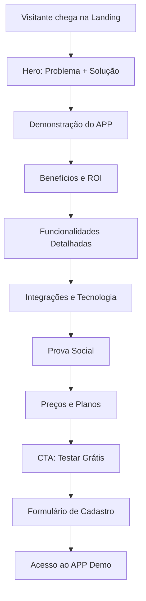

# Landing Page Reformulada - PRD

## 1. Visão Geral do Produto

A Landing Page deve ser uma **ferramenta de conversão B2B** focada em donos de barbearias que querem digitalizar e otimizar seus negócios. O objetivo é demonstrar como o APP resolve problemas reais do dia a dia de uma barbearia e gera mais receita através da tecnologia.

**Problema a resolver:** Donos de barbearia perdem clientes por falta de organização, não conseguem gerenciar agendamentos eficientemente, e não aproveitam oportunidades de venda digital.

**Solução:** Um APP completo que automatiza agendamentos, integra com ferramentas essenciais, e melhora a experiência do cliente.

## 2. Funcionalidades Principais

### 2.1 Estrutura da Landing Page

**Páginas essenciais:**
1. **Home**: Apresentação do problema e solução
2. **Funcionalidades**: Demonstração detalhada do APP
3. **Integrações**: Showcase das integrações disponíveis
4. **Preços**: Planos e investimento
5. **Demo**: Acesso ao APP de demonstração

### 2.2 Seções da Home Page

| Seção | Módulo | Descrição |
|-------|--------|-----------|
| Hero | Proposta de Valor | "Transforme sua barbearia em um negócio digital. Aumente sua receita em 40% com agendamentos automatizados" |
| Problemas | Pain Points | Mostrar problemas reais: clientes perdidos, desorganização, falta de controle |
| Solução | APP Demo | Demonstração visual do APP funcionando em mobile |
| Benefícios | ROI Calculator | Calculadora mostrando aumento de receita com o APP |
| Funcionalidades | Feature Showcase | Grid com principais funcionalidades do APP |
| Integrações | Tech Stack | Logos e explicações das integrações (Google, WhatsApp, N8N, AI) |
| Prova Social | Testimonials | Depoimentos de barbeiros que usam o sistema |
| Preços | Pricing Plans | Planos claros com foco no ROI |
| CTA Final | Download/Trial | Botão para testar o APP gratuitamente |

## 3. Conteúdo Focado no Negócio

### 3.1 Mensagens Principais

**Headline Principal:** "O APP que Transforma sua Barbearia em um Negócio Digital"

**Sub-headlines:**
- "Aumente sua receita em até 40% com agendamentos automatizados"
- "Nunca mais perca um cliente por desorganização"
- "Integre WhatsApp, Google Calendar e IA em um só lugar"

### 3.2 Benefícios para o Dono da Barbearia

1. **Mais Receita**: Agendamentos 24/7, upsell automático de produtos
2. **Menos Trabalho**: Automação de confirmações via WhatsApp
3. **Melhor Organização**: Agenda sincronizada com Google Calendar
4. **Clientes Satisfeitos**: Interface moderna e fácil de usar
5. **Insights de Negócio**: Relatórios automáticos de performance

### 3.3 Funcionalidades em Destaque

**Para o Cliente Final:**
- Agendamento online 24/7
- Escolha de profissional e serviço
- Confirmação automática via WhatsApp
- Histórico de cortes e preferências
- Avaliação e feedback

**Para o Dono da Barbearia:**
- Dashboard com métricas de negócio
- Gestão de funcionários e horários
- Catálogo de produtos e serviços
- Integrações com ferramentas externas
- Relatórios financeiros automáticos

## 4. Integrações em Destaque

### 4.1 Google Calendar
- Sincronização automática de agendamentos
- Bloqueio de horários ocupados
- Lembretes automáticos

### 4.2 WhatsApp Business API
- Confirmações automáticas de agendamento
- Lembretes 24h antes do corte
- Feedback pós-atendimento
- Suporte ao cliente

### 4.3 N8N (Automação)
- Workflows personalizados
- Integração com CRM
- Automação de marketing
- Relatórios automáticos

### 4.4 Agentes de IA
- Atendimento automatizado 24/7
- Recomendações personalizadas
- Análise de sentimento dos clientes
- Otimização de horários

## 5. Design e UX

### 5.1 Estilo Visual
- **Cores**: Preto (#000000), Dourado (#FFD700), Branco (#FFFFFF)
- **Tipografia**: Moderna e profissional (Inter/Roboto)
- **Estilo**: Minimalista, focado em conversão
- **Imagens**: Screenshots reais do APP, fotos de barbearias modernas

### 5.2 Elementos de Conversão
- **CTAs claros**: "Testar Grátis", "Ver Demo", "Falar com Especialista"
- **Prova social**: Números de barbeiros usando, avaliações
- **Urgência**: "Oferta limitada", "Primeiros 100 barbeiros"
- **Garantia**: "30 dias grátis", "Sem compromisso"

## 6. Fluxo de Conversão

## 7. Métricas de Sucesso

- **Taxa de conversão**: > 5% de visitantes para trial
- **Tempo na página**: > 3 minutos
- **Scroll depth**: > 80% da página
- **Cliques no CTA**: > 15% dos visitantes
- **Formulários preenchidos**: > 3% dos visitantes

## 8. Conteúdo a Remover

❌ **Remover completamente:**
- Informações sobre cortes específicos
- Preços de serviços de barbearia
- Galeria de cortes
- Informações de localização física
- Conteúdo focado no cliente final da barbearia

✅ **Manter foco em:**
- Benefícios do APP para o negócio
- Funcionalidades de gestão
- Integrações tecnológicas
- ROI e resultados
- Demonstração do produto