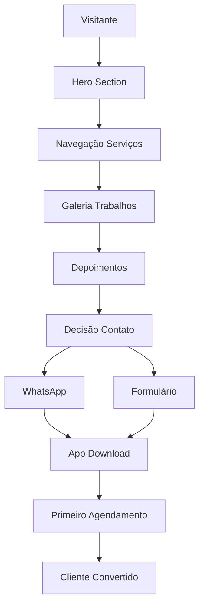

# Landing Page Barbearia - Documento de Requisitos

## 1. Product Overview

Landing page promocional e institucional para barbearias que serve como vitrine digital dos serviços oferecidos. A página tem como objetivo principal converter visitantes em clientes através de uma apresentação atrativa dos trabalhos realizados, facilitar o primeiro contato via WhatsApp e direcionar para o download do app PWA de agendamentos.

A landing page resolve o problema de visibilidade online da barbearia e oferece um canal de conversão otimizado para atrair novos clientes e apresentar a qualidade dos serviços.

## 2. Core Features

### 2.1 User Roles

| Role | Registration Method | Core Permissions |
|------|---------------------|------------------|
| Visitante | Acesso livre | Visualizar conteúdo, fazer contato, acessar informações |
| Lead | Formulário de contato | Receber comunicações promocionais |

### 2.2 Feature Module

Nossa landing page consiste nas seguintes seções principais:

1. **Hero Section**: apresentação impactante da barbearia, call-to-action principal, navegação
2. **Sobre Nós**: história da barbearia, diferenciais, equipe de profissionais
3. **Serviços**: catálogo completo de serviços oferecidos com preços e descrições
4. **Galeria**: portfólio visual dos trabalhos realizados, antes e depois
5. **Depoimentos**: avaliações e comentários de clientes satisfeitos
6. **Localização**: mapa interativo, endereço, horários de funcionamento
7. **Contato**: formulário de contato, integração WhatsApp, redes sociais
8. **Footer**: informações complementares, links úteis, políticas

### 2.3 Page Details

| Page Name | Module Name | Feature description |
|-----------|-------------|---------------------|
| Landing Page | Hero Section | Exibir vídeo/imagem de fundo, título impactante, botão "Agendar Agora", menu de navegação |
| Landing Page | Sobre Nós | Apresentar história da barbearia, missão e valores, fotos da equipe |
| Landing Page | Serviços | Listar serviços em cards, mostrar preços, duração, descrições detalhadas |
| Landing Page | Galeria | Exibir grid de fotos, filtros por categoria, lightbox para visualização ampliada |
| Landing Page | Depoimentos | Carousel de avaliações, fotos dos clientes, sistema de estrelas |
| Landing Page | Localização | Integrar Google Maps, mostrar endereço, horários, informações de contato |
| Landing Page | Formulário Contato | Capturar nome, telefone, serviço de interesse, integração WhatsApp |
| Landing Page | Call-to-Actions | Botões estratégicos para WhatsApp, download do app, agendamento |
| Landing Page | SEO Otimização | Meta tags, structured data, sitemap, otimização para buscadores |
| Landing Page | Analytics | Integração Google Analytics, Facebook Pixel, tracking de conversões |

## 3. Core Process

**Fluxo do Visitante:**
1. Visitante acessa a landing page via busca ou redes sociais
2. Visualiza hero section com proposta de valor clara
3. Navega pelos serviços oferecidos e galeria de trabalhos
4. Lê depoimentos de outros clientes
5. Decide fazer contato via WhatsApp ou formulário
6. É direcionado para download do app PWA
7. Torna-se cliente da barbearia

**Fluxo de Conversão:**
1. Visitante interessado clica em call-to-action
2. Preenche formulário com dados básicos
3. É redirecionado para WhatsApp com mensagem pré-formatada
4. Recebe link para download do app
5. Agenda primeiro atendimento
6. Vira cliente recorrente

## 4. User Interface Design

### 4.1 Design Style

- **Cores Primárias**: #1a1a1a (preto elegante), #d4af37 (dourado premium), #ffffff (branco limpo)
- **Cores Secundárias**: #2d2d2d (cinza escuro), #f5f5f5 (cinza claro), #c0392b (vermelho para CTAs)
- **Estilo de Botões**: Bordas arredondadas 8px, gradiente dourado, sombra sutil, hover com elevação
- **Fontes**: Playfair Display (títulos elegantes), Lato (texto corpo), tamanhos 16px-48px
- **Layout**: Single page scroll, seções full-width, grid responsivo, animações suaves
- **Ícones**: Font Awesome, estilo solid, cores douradas para destaques

### 4.2 Page Design Overview

| Page Name | Module Name | UI Elements |
|-----------|-------------|-------------|
| Landing Page | Hero Section | Background video loop, overlay escuro, título grande, CTA dourado centralizado |
| Landing Page | Serviços | Cards com ícones, preços destacados, hover effects, layout grid 3 colunas |
| Landing Page | Galeria | Masonry layout, filtros superiores, lightbox modal, lazy loading |
| Landing Page | Depoimentos | Carousel horizontal, cards com foto e texto, indicadores de navegação |
| Landing Page | Contato | Formulário estilizado, mapa integrado, ícones de contato, botão WhatsApp fixo |
| Landing Page | Footer | Background escuro, links organizados em colunas, redes sociais |

### 4.3 Responsiveness

Design mobile-first com breakpoints em 768px e 1024px. Navegação mobile com menu hamburger, hero section adaptado para vertical, galeria em grid responsivo. Otimização de imagens para diferentes densidades de tela e carregamento progressivo para melhor performance.