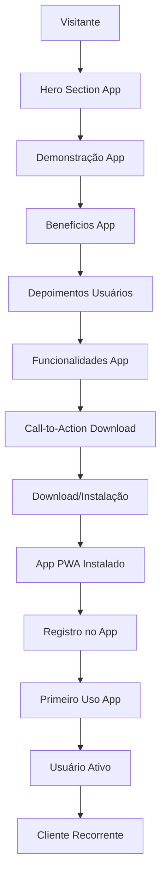

# Landing Page Barbearia - Documento de Requisitos

## 1. Product Overview

Landing page de conversão e marketing para promover o aplicativo PWA da barbearia. A página tem como objetivo principal **converter visitantes em usuários do app** através da demonstração dos benefícios, funcionalidades e experiências proporcionadas pelo aplicativo. Não realiza agendamentos diretos - apenas promove e direciona para o download do app.

A landing page resolve o problema de aquisição de usuários para o app, servindo como ferramenta de marketing digital para demonstrar o valor do aplicativo e converter visitantes em usuários ativos da plataforma de agendamento.

## 2. Core Features

### 2.1 User Roles

| Role | Registration Method | Core Permissions |
|------|---------------------|------------------|
| Visitante | Acesso livre | Visualizar conteúdo, fazer contato, acessar informações |
| Lead | Formulário de contato | Receber comunicações promocionais |

### 2.2 Feature Module

Nossa landing page de conversão consiste nas seguintes seções principais:

1. **Hero Section**: apresentação do app, benefícios principais, call-to-action para download
2. **Demonstração do App**: screenshots, vídeo demonstrativo, funcionalidades principais
3. **Benefícios do App**: vantagens de usar o aplicativo, comparação com métodos tradicionais
4. **Depoimentos de Usuários**: avaliações reais de usuários do app, casos de sucesso
5. **Funcionalidades**: detalhamento das principais features do aplicativo
6. **Download/Instalação**: botões de download, QR code, instruções de instalação
7. **FAQ sobre o App**: dúvidas frequentes sobre o uso do aplicativo
8. **Footer**: links para o app, suporte, políticas de privacidade

### 2.3 Page Details

| Page Name | Module Name | Feature description |
|-----------|-------------|---------------------|
| Landing Page | Hero Section | Apresentar benefícios do app, título impactante "Baixe nosso App", botão de download principal |
| Landing Page | Demonstração App | Exibir screenshots do app, vídeo demonstrativo, tour pelas funcionalidades |
| Landing Page | Benefícios App | Listar vantagens do app: agendamento 24h, notificações, histórico, facilidade |
| Landing Page | Depoimentos Usuários | Carousel com avaliações reais de usuários do app, experiências de uso |
| Landing Page | Funcionalidades | Destacar features principais: agendamento, pagamento, chat, notificações |
| Landing Page | Download/Instalação | Botões para download, QR code, badges das stores, instruções de instalação |
| Landing Page | FAQ App | Perguntas frequentes sobre o uso do aplicativo, suporte, funcionalidades |
| Landing Page | Call-to-Actions | Botões estratégicos para download do app distribuídos pela página |
| Landing Page | SEO Otimização | Meta tags focadas no app, structured data, otimização para "app barbearia" |
| Landing Page | Analytics | Tracking de conversões para download, funil de conversão, métricas de app |

## 3. Core Process

**Fluxo de Conversão para o App:**
1. Visitante acessa a landing page via busca, redes sociais ou anúncios
2. Visualiza hero section com benefícios do app e call-to-action principal
3. Assiste demonstração do app através de screenshots e vídeo
4. Lê sobre os benefícios e vantagens de usar o aplicativo
5. Visualiza depoimentos reais de usuários satisfeitos com o app
6. Entende as funcionalidades principais do aplicativo
7. Clica em botão de download ou escaneia QR code
8. Baixa e instala o app PWA
9. Torna-se usuário ativo do aplicativo

**Fluxo de Aquisição de Usuário:**
1. Visitante interessado no app clica em call-to-action
2. É direcionado para instalação do PWA ou store
3. Instala o aplicativo no dispositivo
4. Abre o app e cria sua conta
5. Explora as funcionalidades do app
6. Realiza primeiro agendamento através do app
7. Torna-se cliente recorrente da barbearia via app

## 4. User Interface Design

### 4.1 Design Style

- **Cores Primárias**: #1a1a1a (preto elegante), #d4af37 (dourado premium), #ffffff (branco limpo)
- **Cores Secundárias**: #2d2d2d (cinza escuro), #f5f5f5 (cinza claro), #c0392b (vermelho para CTAs)
- **Estilo de Botões**: Bordas arredondadas 8px, gradiente dourado, sombra sutil, hover com elevação
- **Fontes**: Playfair Display (títulos elegantes), Lato (texto corpo), tamanhos 16px-48px
- **Layout**: Single page scroll, seções full-width, grid responsivo, animações suaves
- **Ícones**: Font Awesome, estilo solid, cores douradas para destaques

### 4.2 Page Design Overview

| Page Name | Module Name | UI Elements |
|-----------|-------------|-------------|
| Landing Page | Hero Section | Background video loop, overlay escuro, título grande, CTA dourado centralizado |
| Landing Page | Serviços | Cards com ícones, preços destacados, hover effects, layout grid 3 colunas |
| Landing Page | Galeria | Masonry layout, filtros superiores, lightbox modal, lazy loading |
| Landing Page | Depoimentos | Carousel horizontal, cards com foto e texto, indicadores de navegação |
| Landing Page | Contato | Formulário estilizado, mapa integrado, ícones de contato, botão WhatsApp fixo |
| Landing Page | Footer | Background escuro, links organizados em colunas, redes sociais |

### 4.3 Responsiveness

Design mobile-first com breakpoints em 768px e 1024px. Navegação mobile com menu hamburger, hero section adaptado para vertical, galeria em grid responsivo. Otimização de imagens para diferentes densidades de tela e carregamento progressivo para melhor performance.