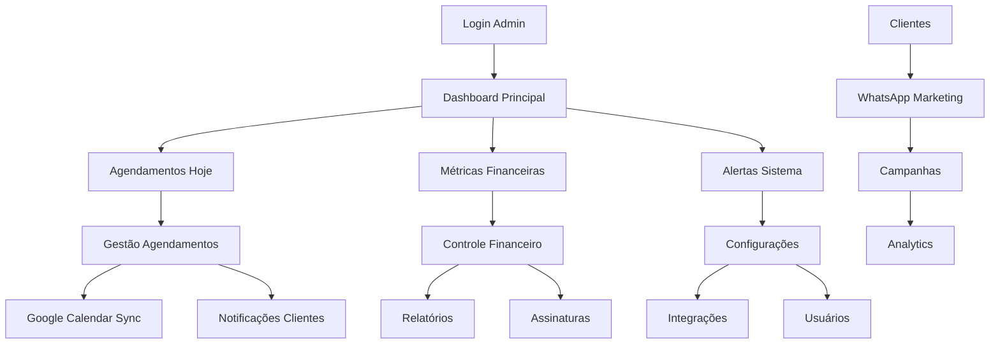

# Painel Administrativo Barbearia - Documento de Requisitos

## 1. Product Overview

Sistema de gestão completo para proprietários e administradores de barbearias que centraliza o controle de agendamentos, clientes, serviços, financeiro e configurações. O painel oferece visão 360° do negócio com relatórios detalhados, integração com Google Calendar e WhatsApp, além de gestão de assinaturas e pagamentos.

O painel resolve problemas de gestão manual, falta de controle financeiro e dificuldade de acompanhar métricas do negócio. Destinado a proprietários, gerentes e barbeiros com permissões específicas.

## 2. Core Features

### 2.1 User Roles

| Role | Registration Method | Core Permissions |
|------|---------------------|------------------|
| Proprietário | Acesso master inicial | Controle total: usuários, configurações, financeiro, relatórios |
| Gerente | Convite do proprietário | Gestão operacional: agendamentos, clientes, serviços |
| Barbeiro | Convite do gerente/proprietário | Visualizar agenda própria, atualizar status, gerenciar clientes |
| Atendente | Convite com permissões limitadas | Agendamentos, consulta de clientes, recepção |

### 2.2 Feature Module

Nosso painel administrativo consiste nas seguintes seções principais:

1. **Dashboard**: visão geral do negócio, métricas principais, agendamentos do dia
2. **Agendamentos**: gestão completa da agenda, visualização por barbeiro, status
3. **Clientes**: base de dados de clientes, histórico, comunicação, segmentação
4. **Serviços**: catálogo de serviços, preços, categorias, promoções
5. **Barbeiros**: gestão da equipe, horários, especialidades, performance
6. **Financeiro**: controle de pagamentos, receitas, despesas, relatórios
7. **Assinaturas**: gestão de planos, renovações, cobrança recorrente
8. **Marketing**: campanhas WhatsApp, promoções, fidelização
9. **Relatórios**: analytics detalhados, exportação, dashboards customizados
10. **Configurações**: integrações, notificações, dados da barbearia

### 2.3 Page Details

| Page Name | Module Name | Feature description |
|-----------|-------------|---------------------|
| Dashboard | Métricas Principais | Exibir receita do dia/mês, agendamentos, clientes ativos, crescimento |
| Dashboard | Agendamentos Hoje | Lista de agendamentos do dia, status em tempo real, ações rápidas |
| Dashboard | Gráficos Performance | Charts de receita, serviços populares, horários de pico |
| Agendamentos | Calendário Geral | Visualização por dia/semana/mês, filtros por barbeiro, cores por status |
| Agendamentos | Gestão Individual | Criar, editar, cancelar agendamentos, reagendamento automático |
| Agendamentos | Sincronização Google | Integração bidirecional com Google Calendar, resolução de conflitos |
| Clientes | Base de Dados | Lista completa, busca avançada, filtros, exportação |
| Clientes | Perfil Detalhado | Histórico completo, preferências, comunicação, notas internas |
| Clientes | Comunicação WhatsApp | Envio de mensagens, templates, campanhas segmentadas |
| Serviços | Catálogo Completo | CRUD de serviços, categorização, preços dinâmicos |
| Serviços | Gestão Preços | Tabelas de preços, promoções temporárias, pacotes |
| Barbeiros | Gestão Equipe | Cadastro de barbeiros, especialidades, horários de trabalho |
| Barbeiros | Performance Individual | Métricas por barbeiro, avaliações, comissões |
| Financeiro | Controle Caixa | Entradas e saídas, formas de pagamento, conciliação |
| Financeiro | Relatórios Financeiros | DRE simplificado, fluxo de caixa, projeções |
| Assinaturas | Gestão Planos | Criar planos mensais/anuais, controle de renovações |
| Assinaturas | Cobrança Automática | Integração Stripe, gestão de inadimplência, notificações |
| Marketing | Campanhas WhatsApp | Criação de campanhas, segmentação, métricas de conversão |
| Marketing | Programa Fidelidade | Pontuação por serviços, recompensas, gamificação |
| Relatórios | Analytics Avançado | Relatórios customizados, exportação PDF/Excel, agendamento automático |
| Relatórios | Dashboards | Widgets configuráveis, métricas em tempo real, comparativos |
| Configurações | Integrações | Setup Google Calendar, WhatsApp Business, pagamentos |
| Configurações | Dados Barbearia | Informações básicas, horários, políticas, equipe |

## 3. Core Process

**Fluxo Diário do Administrador:**
1. Acessa dashboard e visualiza métricas do dia
2. Revisa agendamentos e confirma presença dos clientes
3. Gerencia eventuais cancelamentos ou reagendamentos
4. Monitora performance dos barbeiros
5. Responde mensagens de clientes via WhatsApp
6. Atualiza preços ou promoções conforme necessário
7. Analisa relatórios de performance
8. Planeja ações de marketing

**Fluxo de Gestão Financeira:**
1. Registra pagamentos recebidos no dia
2. Controla despesas operacionais
3. Monitora assinaturas e renovações
4. Gera relatórios financeiros
5. Analisa lucratividade por serviço
6. Planeja investimentos e melhorias



## 4. User Interface Design

### 4.1 Design Style

- **Cores Primárias**: #1a1a1a (sidebar), #ffffff (conteúdo), #d4af37 (acentos)
- **Cores Secundárias**: #f8f9fa (background), #6c757d (texto secundário), #28a745 (sucesso)
- **Estilo de Botões**: Bootstrap-inspired, bordas arredondadas 6px, estados hover/active
- **Fontes**: Inter (interface), tamanhos 12px-28px, peso 400-600
- **Layout**: Sidebar fixa, conteúdo responsivo, cards com sombra sutil
- **Ícones**: Feather Icons, stroke 1.5px, cores consistentes

### 4.2 Page Design Overview

| Page Name | Module Name | UI Elements |
|-----------|-------------|-------------|
| Dashboard | Header | Breadcrumb, notificações, perfil usuário, busca global |
| Dashboard | Sidebar | Menu hierárquico, ícones, badges de notificação, collapse |
| Dashboard | Widgets | Cards de métricas, gráficos Chart.js, tabelas responsivas |
| Agendamentos | Calendário | FullCalendar.js, cores por status, modal de detalhes |
| Agendamentos | Filtros | Dropdowns múltiplos, date picker, busca em tempo real |
| Clientes | Tabela | DataTables com paginação, ordenação, filtros avançados |
| Clientes | Modal Perfil | Tabs organizadas, formulários validados, histórico timeline |
| Financeiro | Gráficos | Charts de linha/barra, filtros de período, drill-down |
| Relatórios | Exportação | Botões de ação, preview PDF, agendamento de envio |

### 4.3 Responsiveness

Interface desktop-first com adaptação para tablets. Sidebar colapsível em telas menores, tabelas com scroll horizontal, modais responsivos. Otimização para produtividade com atalhos de teclado e navegação rápida.

## 5. Integrações e APIs

### 5.1 Google Calendar Integration

```javascript
// Sincronização bidirecional
- Criar eventos no Google Calendar quando agendamento é feito
- Atualizar status quando evento é modificado no Google
- Detectar conflitos e resolver automaticamente
- Suporte a múltiplos calendários (um por barbeiro)
```

### 5.2 WhatsApp Business API

```javascript
// Funcionalidades de comunicação
- Envio de mensagens individuais e em massa
- Templates pré-aprovados para diferentes situações
- Webhook para receber respostas
- Métricas de entrega e leitura
```

### 5.3 Sistema de Pagamentos

```javascript
// Integração Stripe
- Processamento de pagamentos online
- Assinaturas recorrentes
- Webhooks para status de pagamento
- Relatórios de transações
```

## 6. Relatórios e Analytics

### 6.1 Métricas Principais

- **Financeiras**: Receita diária/mensal, ticket médio, crescimento
- **Operacionais**: Taxa de ocupação, no-shows, reagendamentos
- **Clientes**: Novos clientes, retenção, lifetime value
- **Barbeiros**: Performance individual, avaliações, comissões

### 6.2 Dashboards Customizáveis

- Widgets arrastáveis e redimensionáveis
- Filtros de período personalizáveis
- Exportação automática de relatórios
- Alertas baseados em métricas

### 6.3 Exportação de Dados

- Relatórios em PDF com branding da barbearia
- Planilhas Excel com dados detalhados
- APIs para integração com outros sistemas
- Backup automático de dados