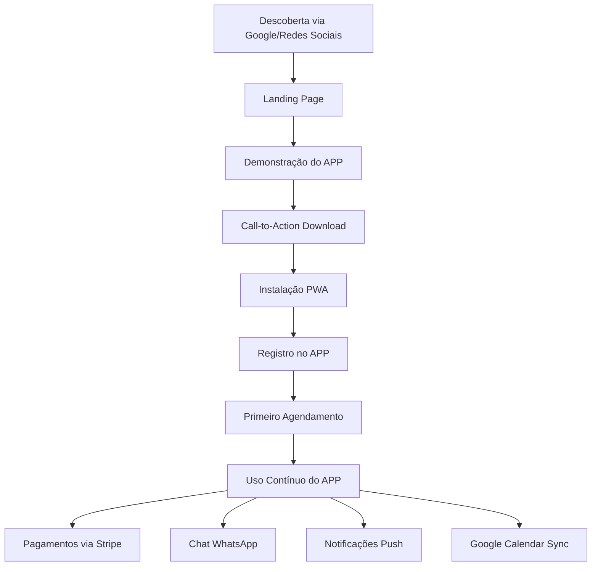

# Resumo das Atualizações da Arquitetura do Sistema

## ✅ Correções Implementadas

### 🎯 **Problema Identificado**
A documentação original estava misturando as responsabilidades da **Landing Page** e do **APP PWA**, tratando a landing page como se fosse um sistema de agendamento direto.

### 🔄 **Nova Arquitetura Correta**

#### **LANDING PAGE** - Página de Conversão/Marketing
- **Função**: Promover e converter visitantes para o APP PWA
- **Objetivo**: Gerar downloads e instalações do aplicativo
- **Conteúdo**: 
  - Benefícios do APP
  - Demonstrações das funcionalidades
  - Depoimentos de usuários
  - Call-to-actions para download
  - FAQ sobre o APP
- **NÃO faz**: Agendamentos diretos ou funcionalidades reais

#### **APP PWA** - Aplicativo Principal
- **Função**: Todas as funcionalidades reais do sistema
- **Recursos Completos**:
  - Sistema de agendamento
  - Pagamentos integrados (Stripe)
  - Chat WhatsApp Business
  - Sincronização Google Calendar
  - Notificações push
  - Histórico de serviços
  - Perfil do usuário
  - Avaliações e feedback

#### **PAINEL ADMINISTRATIVO**
- **Função**: Gerenciar dados vindos do APP PWA
- **Recursos**: Analytics, relatórios, configurações, gestão de barbeiros

---

## 📋 **Documentos Atualizados**

### 1. **sistema-barbearia-prd.md**
- ✅ Redefiniu o sistema como composto por: Landing Page (conversão) + APP PWA (funcionalidades) + Painel Admin
- ✅ Separou claramente as responsabilidades de cada componente
- ✅ Atualizou fluxos de usuário: Conversão → Download → Uso do APP
- ✅ Corrigiu diagramas Mermaid para refletir a nova arquitetura

### 2. **sistema-barbearia-arquitetura.md**
- ✅ Reorganizou a arquitetura técnica em camadas distintas
- ✅ Definiu Landing Page como "Marketing Layer" (estática)
- ✅ Definiu APP PWA como "Application Layer" (funcional)
- ✅ Atualizou tecnologias e rotas específicas para cada componente
- ✅ Manteve integrações (Google Calendar, WhatsApp, Stripe) no APP PWA

### 3. **landing-page-requisitos.md**
- ✅ Reposicionou completamente como ferramenta de conversão
- ✅ Removeu funcionalidades de agendamento direto
- ✅ Focou em demonstração e promoção do APP
- ✅ Adicionou seções específicas: benefícios, depoimentos, download
- ✅ Atualizou fluxos para conversão de visitantes em usuários do APP

### 4. **app-pwa-requisitos.md**
- ✅ Reforçou como aplicativo principal com todas as funcionalidades
- ✅ Manteve todas as integrações e recursos avançados
- ✅ Confirmou como destino final dos usuários convertidos

### 5. **visao-geral-sistema.md**
- ✅ Atualizou visão geral para refletir a nova arquitetura
- ✅ Redefiniu fluxos integrados: Descoberta → Landing → APP → Uso
- ✅ Corrigiu benefícios para cada componente específico

### 6. **painel-admin-requisitos.md**
- ✅ Clarificou que gerencia dados vindos do APP PWA
- ✅ Manteve todas as funcionalidades administrativas

---

## 🎯 **Fluxo Correto do Usuário**

---

## ✨ **Benefícios da Nova Arquitetura**

### **Para o Negócio**
- **Funil de conversão claro**: Landing → APP → Cliente ativo
- **Métricas precisas**: Conversões da landing vs. uso do APP
- **Escalabilidade**: Landing estática + APP funcional

### **Para os Usuários**
- **Experiência nativa**: APP PWA instalável
- **Funcionalidades completas**: Tudo no APP
- **Descoberta fácil**: Landing page otimizada para conversão

### **Para o Desenvolvimento**
- **Separação de responsabilidades**: Marketing vs. Funcionalidade
- **Deploy independente**: Landing estática, APP dinâmico
- **Manutenção simplificada**: Cada componente com propósito específico

---

## 🚀 **Próximos Passos**

1. **Desenvolvimento da Landing Page**: Foco em conversão e marketing
2. **Desenvolvimento do APP PWA**: Todas as funcionalidades principais
3. **Integração do Painel Admin**: Gestão dos dados do APP
4. **Testes de Conversão**: Otimização do funil Landing → APP

---

**Status**: ✅ **Documentação Completamente Atualizada e Alinhada**

Todas as correções foram implementadas com sucesso. A arquitetura agora reflete corretamente a separação entre a Landing Page (conversão) e o APP PWA (funcionalidades), proporcionando uma base sólida para o desenvolvimento do sistema.