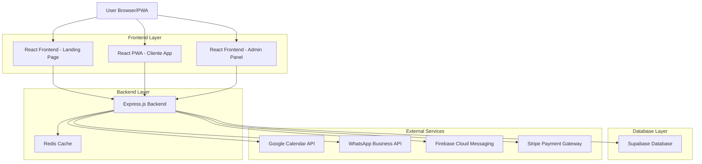
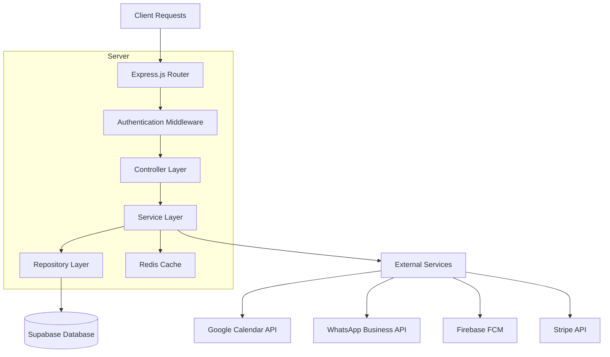
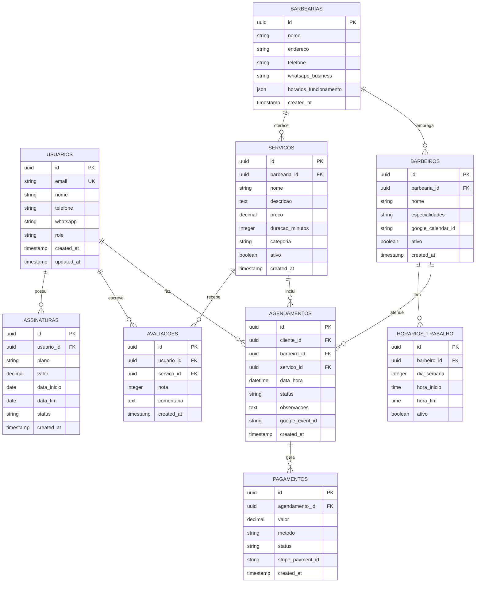

# Sistema de Gestão para Barbearias - Arquitetura Técnica

## 1. Architecture design



## 2. Technology Description

- **Frontend**: React@18 + TypeScript + Tailwind CSS + Vite + PWA
- **Backend**: Express.js@4 + TypeScript + Node.js@20
- **Database**: Supabase (PostgreSQL) + Redis para cache
- **Autenticação**: Supabase Auth + JWT
- **Notificações**: Firebase Cloud Messaging
- **Pagamentos**: Stripe
- **Integrações**: Google Calendar API + WhatsApp Business API

## 3. Route definitions

| Route | Purpose |
|-------|---------|
| / | Landing page principal da barbearia |
| /servicos | Página de serviços oferecidos |
| /galeria | Galeria de trabalhos realizados |
| /contato | Formulário de contato e localização |
| /app | PWA - Dashboard do cliente |
| /app/agendamento | PWA - Sistema de agendamento |
| /app/perfil | PWA - Perfil e configurações do cliente |
| /app/historico | PWA - Histórico de agendamentos |
| /admin | Painel administrativo - Dashboard |
| /admin/agendamentos | Gestão de agendamentos |
| /admin/servicos | Gestão de serviços e preços |
| /admin/clientes | Gestão de clientes |
| /admin/financeiro | Controle financeiro e pagamentos |
| /admin/configuracoes | Configurações do sistema |
| /admin/relatorios | Relatórios e analytics |

## 4. API definitions

### 4.1 Core API

**Autenticação**
```
POST /api/auth/login
```

Request:
| Param Name| Param Type  | isRequired  | Description |
|-----------|-------------|-------------|-------------|
| email     | string      | true        | Email do usuário |
| password  | string      | true        | Senha do usuário |

Response:
| Param Name| Param Type  | Description |
|-----------|-------------|-------------|
| token     | string      | JWT token de autenticação |
| user      | object      | Dados do usuário |
| role      | string      | Papel do usuário (cliente/barbeiro/admin) |

**Agendamentos**
```
POST /api/agendamentos
```

Request:
| Param Name| Param Type  | isRequired  | Description |
|-----------|-------------|-------------|-------------|
| cliente_id| string      | true        | ID do cliente |
| barbeiro_id| string     | true        | ID do barbeiro |
| servico_id| string      | true        | ID do serviço |
| data_hora | datetime    | true        | Data e hora do agendamento |
| observacoes| string     | false       | Observações especiais |

Response:
| Param Name| Param Type  | Description |
|-----------|-------------|-------------|
| id        | string      | ID do agendamento criado |
| status    | string      | Status do agendamento |
| google_event_id| string | ID do evento no Google Calendar |

**Serviços**
```
GET /api/servicos
```

Response:
| Param Name| Param Type  | Description |
|-----------|-------------|-------------|
| servicos  | array       | Lista de serviços disponíveis |

**Notificações**
```
POST /api/notificacoes/push
```

Request:
| Param Name| Param Type  | isRequired  | Description |
|-----------|-------------|-------------|-------------|
| user_id   | string      | true        | ID do usuário |
| titulo    | string      | true        | Título da notificação |
| mensagem  | string      | true        | Conteúdo da mensagem |
| tipo      | string      | true        | Tipo: lembrete/promocao/confirmacao |

**WhatsApp Integration**
```
POST /api/whatsapp/enviar
```

Request:
| Param Name| Param Type  | isRequired  | Description |
|-----------|-------------|-------------|-------------|
| numero    | string      | true        | Número do WhatsApp |
| mensagem  | string      | true        | Mensagem a ser enviada |
| template  | string      | false       | Template pré-definido |

**Google Calendar Sync**
```
POST /api/calendar/sync
```

Request:
| Param Name| Param Type  | isRequired  | Description |
|-----------|-------------|-------------|-------------|
| agendamento_id| string  | true        | ID do agendamento |
| action    | string      | true        | create/update/delete |

## 5. Server architecture diagram



## 6. Data model

### 6.1 Data model definition



### 6.2 Data Definition Language

**Tabela Usuários**
```sql
-- Criar tabela de usuários
CREATE TABLE usuarios (
    id UUID PRIMARY KEY DEFAULT gen_random_uuid(),
    email VARCHAR(255) UNIQUE NOT NULL,
    nome VARCHAR(100) NOT NULL,
    telefone VARCHAR(20),
    whatsapp VARCHAR(20),
    role VARCHAR(20) DEFAULT 'cliente' CHECK (role IN ('cliente', 'barbeiro', 'admin')),
    fcm_token TEXT,
    created_at TIMESTAMP WITH TIME ZONE DEFAULT NOW(),
    updated_at TIMESTAMP WITH TIME ZONE DEFAULT NOW()
);

-- Criar índices
CREATE INDEX idx_usuarios_email ON usuarios(email);
CREATE INDEX idx_usuarios_role ON usuarios(role);
```

**Tabela Barbearias**
```sql
CREATE TABLE barbearias (
    id UUID PRIMARY KEY DEFAULT gen_random_uuid(),
    nome VARCHAR(100) NOT NULL,
    endereco TEXT,
    telefone VARCHAR(20),
    whatsapp_business VARCHAR(20),
    horarios_funcionamento JSONB,
    configuracoes JSONB,
    created_at TIMESTAMP WITH TIME ZONE DEFAULT NOW(),
    updated_at TIMESTAMP WITH TIME ZONE DEFAULT NOW()
);
```

**Tabela Barbeiros**
```sql
CREATE TABLE barbeiros (
    id UUID PRIMARY KEY DEFAULT gen_random_uuid(),
    usuario_id UUID REFERENCES usuarios(id),
    barbearia_id UUID REFERENCES barbearias(id),
    especialidades TEXT[],
    google_calendar_id VARCHAR(255),
    ativo BOOLEAN DEFAULT true,
    created_at TIMESTAMP WITH TIME ZONE DEFAULT NOW()
);

CREATE INDEX idx_barbeiros_barbearia ON barbeiros(barbearia_id);
CREATE INDEX idx_barbeiros_ativo ON barbeiros(ativo);
```

**Tabela Serviços**
```sql
CREATE TABLE servicos (
    id UUID PRIMARY KEY DEFAULT gen_random_uuid(),
    barbearia_id UUID REFERENCES barbearias(id),
    nome VARCHAR(100) NOT NULL,
    descricao TEXT,
    preco DECIMAL(10,2) NOT NULL,
    duracao_minutos INTEGER NOT NULL,
    categoria VARCHAR(50),
    ativo BOOLEAN DEFAULT true,
    created_at TIMESTAMP WITH TIME ZONE DEFAULT NOW()
);

CREATE INDEX idx_servicos_barbearia ON servicos(barbearia_id);
CREATE INDEX idx_servicos_categoria ON servicos(categoria);
```

**Tabela Agendamentos**
```sql
CREATE TABLE agendamentos (
    id UUID PRIMARY KEY DEFAULT gen_random_uuid(),
    cliente_id UUID REFERENCES usuarios(id),
    barbeiro_id UUID REFERENCES barbeiros(id),
    servico_id UUID REFERENCES servicos(id),
    data_hora TIMESTAMP WITH TIME ZONE NOT NULL,
    status VARCHAR(20) DEFAULT 'agendado' CHECK (status IN ('agendado', 'confirmado', 'em_andamento', 'concluido', 'cancelado')),
    observacoes TEXT,
    google_event_id VARCHAR(255),
    created_at TIMESTAMP WITH TIME ZONE DEFAULT NOW(),
    updated_at TIMESTAMP WITH TIME ZONE DEFAULT NOW()
);

CREATE INDEX idx_agendamentos_cliente ON agendamentos(cliente_id);
CREATE INDEX idx_agendamentos_barbeiro ON agendamentos(barbeiro_id);
CREATE INDEX idx_agendamentos_data ON agendamentos(data_hora);
CREATE INDEX idx_agendamentos_status ON agendamentos(status);
```

**Tabela Pagamentos**
```sql
CREATE TABLE pagamentos (
    id UUID PRIMARY KEY DEFAULT gen_random_uuid(),
    agendamento_id UUID REFERENCES agendamentos(id),
    valor DECIMAL(10,2) NOT NULL,
    metodo VARCHAR(20) CHECK (metodo IN ('dinheiro', 'cartao', 'pix', 'online')),
    status VARCHAR(20) DEFAULT 'pendente' CHECK (status IN ('pendente', 'processando', 'aprovado', 'rejeitado')),
    stripe_payment_id VARCHAR(255),
    created_at TIMESTAMP WITH TIME ZONE DEFAULT NOW()
);

CREATE INDEX idx_pagamentos_agendamento ON pagamentos(agendamento_id);
CREATE INDEX idx_pagamentos_status ON pagamentos(status);
```

**Permissões Supabase**
```sql
-- Permitir acesso básico para usuários anônimos
GRANT SELECT ON servicos TO anon;
GRANT SELECT ON barbearias TO anon;

-- Permitir acesso completo para usuários autenticados
GRANT ALL PRIVILEGES ON usuarios TO authenticated;
GRANT ALL PRIVILEGES ON agendamentos TO authenticated;
GRANT ALL PRIVILEGES ON pagamentos TO authenticated;
GRANT ALL PRIVILEGES ON avaliacoes TO authenticated;

-- Dados iniciais
INSERT INTO barbearias (nome, endereco, telefone, whatsapp_business, horarios_funcionamento) 
VALUES (
    'Barbearia Premium',
    'Rua das Flores, 123 - Centro',
    '(11) 99999-9999',
    '5511999999999',
    '{"segunda": {"inicio": "08:00", "fim": "18:00"}, "terca": {"inicio": "08:00", "fim": "18:00"}}'
);

INSERT INTO servicos (barbearia_id, nome, descricao, preco, duracao_minutos, categoria) 
VALUES 
    ((SELECT id FROM barbearias LIMIT 1), 'Corte Masculino', 'Corte tradicional masculino', 25.00, 30, 'corte'),
    ((SELECT id FROM barbearias LIMIT 1), 'Barba Completa', 'Aparar e modelar barba', 20.00, 20, 'barba'),
    ((SELECT id FROM barbearias LIMIT 1), 'Corte + Barba', 'Pacote completo', 40.00, 45, 'combo');
```