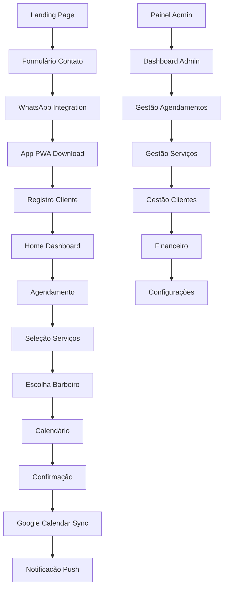

# Sistema de Gestão para Barbearias - Documento de Requisitos do Produto

## 1. Product Overview

Sistema completo de gestão para barbearias que combina um aplicativo PWA para agendamentos, landing page promocional e painel administrativo. A solução integra Google Calendar para sincronização de agenda, WhatsApp para comunicação e sistema de notificações push para melhorar a experiência do cliente e otimizar a gestão do negócio.

O sistema resolve problemas de agendamento manual, falta de comunicação com clientes e dificuldades na gestão de serviços. Destinado a proprietários de barbearias e seus clientes, oferece uma experiência digital moderna que aumenta a eficiência operacional e a satisfação do cliente.

## 2. Core Features

### 2.1 User Roles

| Role | Registration Method | Core Permissions |
|------|---------------------|------------------|
| Cliente | Registro via WhatsApp ou email | Agendar serviços, visualizar histórico, receber notificações |
| Barbeiro | Convite do administrador | Gerenciar agenda pessoal, visualizar agendamentos, atualizar status |
| Administrador | Acesso master do sistema | Gestão completa: serviços, preços, usuários, relatórios, configurações |
| Visitante | Acesso livre à landing page | Visualizar serviços, fazer contato inicial, acessar informações |

### 2.2 Feature Module

Nosso sistema de barbearia consiste nas seguintes páginas principais:

1. **Landing Page**: apresentação da barbearia, galeria de trabalhos, formulário de contato, informações de localização
2. **App PWA - Home**: dashboard do cliente, próximos agendamentos, serviços disponíveis, notificações
3. **App PWA - Agendamento**: seleção de serviços, escolha de barbeiro, calendário disponível, confirmação
4. **App PWA - Perfil**: dados pessoais, histórico de serviços, preferências, configurações de notificação
5. **Painel Admin - Dashboard**: visão geral do negócio, agendamentos do dia, receitas, estatísticas
6. **Painel Admin - Agendamentos**: gestão completa da agenda, visualização por barbeiro, status dos serviços
7. **Painel Admin - Serviços**: cadastro e edição de serviços, preços, duração, categorias
8. **Painel Admin - Clientes**: base de clientes, histórico, preferências, comunicação
9. **Painel Admin - Financeiro**: controle de pagamentos, assinaturas, relatórios financeiros
10. **Painel Admin - Configurações**: integrações, notificações, dados da barbearia, usuários

### 2.3 Page Details

| Page Name | Module Name | Feature description |
|-----------|-------------|---------------------|
| Landing Page | Hero Section | Apresentar barbearia com imagens atrativas, call-to-action para agendamento, informações de contato |
| Landing Page | Galeria de Trabalhos | Exibir fotos dos serviços realizados, antes e depois, categorias de cortes |
| Landing Page | Formulário Contato | Capturar leads, integração WhatsApp, agendamento inicial |
| App PWA - Home | Dashboard Cliente | Mostrar próximos agendamentos, serviços favoritos, notificações recentes |
| App PWA - Home | Notificações Push | Receber lembretes de agendamento, promoções, confirmações |
| App PWA - Agendamento | Seleção Serviços | Escolher tipo de corte, barba, tratamentos, visualizar preços e duração |
| App PWA - Agendamento | Calendário Integrado | Sincronizar com Google Calendar, mostrar horários disponíveis, confirmar agendamento |
| App PWA - Agendamento | Escolha Barbeiro | Selecionar profissional preferido, visualizar agenda individual |
| App PWA - Perfil | Dados Pessoais | Gerenciar informações, WhatsApp, preferências de serviço |
| App PWA - Perfil | Histórico Serviços | Visualizar agendamentos passados, avaliar serviços, reagendar |
| Painel Admin - Dashboard | Visão Geral | Exibir agendamentos do dia, receita, clientes atendidos, métricas |
| Painel Admin - Dashboard | Relatórios | Gerar relatórios de faturamento, serviços mais procurados, performance |
| Painel Admin - Agendamentos | Gestão Agenda | Visualizar, editar, cancelar agendamentos, controlar status |
| Painel Admin - Agendamentos | Integração Google | Sincronizar automaticamente com Google Calendar dos barbeiros |
| Painel Admin - Serviços | Cadastro Serviços | Criar, editar serviços, definir preços, duração, categorias |
| Painel Admin - Serviços | Gestão Preços | Controlar valores, promoções, pacotes, assinaturas mensais/anuais |
| Painel Admin - Clientes | Base Clientes | Gerenciar cadastro, histórico, preferências, comunicação WhatsApp |
| Painel Admin - Clientes | Comunicação | Enviar mensagens, lembretes, promoções via WhatsApp e push |
| Painel Admin - Financeiro | Controle Pagamentos | Processar pagamentos, controlar recebimentos, gestão de inadimplência |
| Painel Admin - Financeiro | Assinaturas | Gerenciar planos mensais/anuais, renovações, expirações |
| Painel Admin - Configurações | Integrações | Configurar Google Calendar, WhatsApp Business, gateway pagamento |
| Painel Admin - Configurações | Dados Barbearia | Gerenciar informações, horários funcionamento, equipe |

## 3. Core Process

**Fluxo do Cliente:**
1. Cliente acessa landing page e conhece os serviços
2. Faz primeiro contato via WhatsApp ou formulário
3. Baixa o app PWA e cria conta
4. Seleciona serviços desejados no app
5. Escolhe barbeiro e horário disponível
6. Confirma agendamento (integração Google Calendar)
7. Recebe notificações de lembrete
8. Comparece ao atendimento
9. Avalia o serviço e pode reagendar

**Fluxo do Administrador:**
1. Acessa painel administrativo
2. Configura serviços, preços e barbeiros
3. Integra Google Calendar e WhatsApp
4. Monitora agendamentos em tempo real
5. Gerencia clientes e comunicação
6. Controla pagamentos e assinaturas
7. Analisa relatórios e métricas
8. Ajusta configurações conforme necessário

## 4. User Interface Design

### 4.1 Design Style

- **Cores Primárias**: #1a1a1a (preto elegante), #d4af37 (dourado premium), #ffffff (branco limpo)
- **Cores Secundárias**: #2d2d2d (cinza escuro), #f5f5f5 (cinza claro), #e74c3c (vermelho para alertas)
- **Estilo de Botões**: Bordas arredondadas (8px), gradiente sutil, efeito hover com elevação
- **Fontes**: Montserrat (títulos), Open Sans (corpo do texto), tamanhos 14px-32px
- **Layout**: Design card-based, navegação superior fixa, sidebar para admin, grid responsivo
- **Ícones**: Material Design Icons, estilo outline, cores consistentes com paleta

### 4.2 Page Design Overview

| Page Name | Module Name | UI Elements |
|-----------|-------------|-------------|
| Landing Page | Hero Section | Background video/imagem, título impactante, CTA dourado, navegação transparente |
| Landing Page | Galeria | Grid masonry, lightbox, filtros por categoria, animações suaves |
| App PWA | Home Dashboard | Cards com próximos agendamentos, menu bottom navigation, notificações badge |
| App PWA | Agendamento | Stepper horizontal, calendário visual, cards de serviços, botões de confirmação |
| Painel Admin | Dashboard | Widgets de métricas, gráficos coloridos, tabela de agendamentos, sidebar escura |
| Painel Admin | Gestão | Tabelas responsivas, modais para edição, filtros avançados, ações em lote |

### 4.3 Responsiveness

Sistema mobile-first com adaptação completa para desktop. O app PWA é otimizado para touch com gestos intuitivos, enquanto o painel admin prioriza produtividade em desktop com atalhos de teclado e múltiplas janelas. Suporte offline para funcionalidades essenciais do app.