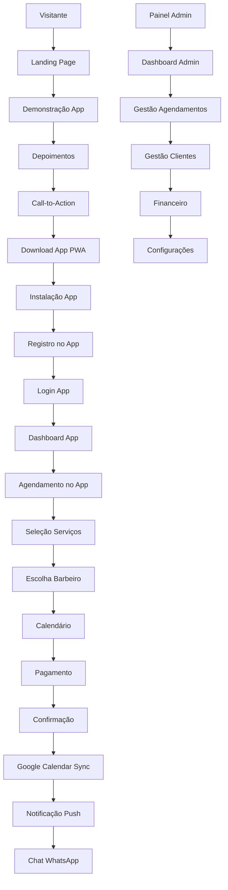

# Sistema de Gestão para Barbearias - Documento de Requisitos do Produto

## 1. Product Overview

Sistema completo de gestão para barbearias composto por um **aplicativo PWA principal** onde estão todas as funcionalidades de agendamento e gestão, uma **landing page de conversão** para promover o app, e um **painel administrativo** para gestão do negócio. O APP PWA é o coração do sistema, integrando Google Calendar, WhatsApp Business API e notificações push para oferecer uma experiência completa de agendamento e gestão.

O sistema resolve problemas de agendamento manual, falta de comunicação com clientes e dificuldades na gestão de serviços. A landing page atua como ferramenta de marketing para converter visitantes em usuários do app, enquanto o APP PWA oferece todas as funcionalidades reais de agendamento, pagamento e comunicação.

## 2. Core Features

### 2.1 User Roles

| Role | Registration Method | Core Permissions |
|------|---------------------|------------------|
| Cliente | Registro via WhatsApp ou email | Agendar serviços, visualizar histórico, receber notificações |
| Barbeiro | Convite do administrador | Gerenciar agenda pessoal, visualizar agendamentos, atualizar status |
| Administrador | Acesso master do sistema | Gestão completa: serviços, preços, usuários, relatórios, configurações |
| Visitante | Acesso livre à landing page | Visualizar serviços, fazer contato inicial, acessar informações |

### 2.2 Feature Module

Nosso sistema de barbearia consiste nos seguintes componentes principais:

**LANDING PAGE (Conversão/Marketing):**
1. **Landing Page**: apresentação da barbearia, demonstração do app, call-to-action para download, depoimentos sobre o app

**APP PWA (Funcionalidades Principais):**
2. **App PWA - Login/Registro**: autenticação, criação de conta, recuperação de senha
3. **App PWA - Home**: dashboard do cliente, próximos agendamentos, notificações, acesso rápido
4. **App PWA - Agendamento**: seleção de serviços, escolha de barbeiro, calendário integrado, confirmação e pagamento
5. **App PWA - Meus Agendamentos**: histórico completo, gestão de agendamentos, reagendamento, cancelamento
6. **App PWA - Perfil**: dados pessoais, preferências, configurações de notificação, histórico de serviços
7. **App PWA - Chat**: comunicação direta com a barbearia via WhatsApp integrado
8. **App PWA - Notificações**: central de mensagens, lembretes, promoções

**PAINEL ADMINISTRATIVO:**
9. **Painel Admin - Dashboard**: visão geral do negócio, métricas, agendamentos do dia
10. **Painel Admin - Agendamentos**: gestão completa da agenda, sincronização Google Calendar
11. **Painel Admin - Clientes**: base de clientes, comunicação WhatsApp, histórico
12. **Painel Admin - Serviços**: cadastro de serviços, preços, categorias
13. **Painel Admin - Financeiro**: controle de pagamentos, relatórios, assinaturas
14. **Painel Admin - Configurações**: integrações, dados da barbearia, equipe

### 2.3 Page Details

| Page Name | Module Name | Feature description |
|-----------|-------------|---------------------|
| **LANDING PAGE (Conversão)** | | |
| Landing Page | Hero Section | Apresentar benefícios do app, call-to-action para download, demonstração visual |
| Landing Page | Demonstração App | Mostrar screenshots do app, vídeo demonstrativo, funcionalidades principais |
| Landing Page | Depoimentos | Avaliações de usuários do app, casos de sucesso, experiências reais |
| Landing Page | Call-to-Action | Botões para download do app, links para stores, QR code |
| **APP PWA (Funcionalidades)** | | |
| App PWA - Login | Autenticação | Login via email/WhatsApp, registro de nova conta, recuperação de senha |
| App PWA - Home | Dashboard Cliente | Mostrar próximos agendamentos, notificações, ações rápidas |
| App PWA - Home | Notificações Push | Receber lembretes de agendamento, promoções, confirmações |
| App PWA - Agendamento | Seleção Serviços | Escolher serviços, visualizar preços e duração, múltipla seleção |
| App PWA - Agendamento | Calendário Integrado | Sincronizar com Google Calendar, horários disponíveis, confirmação |
| App PWA - Agendamento | Escolha Barbeiro | Selecionar profissional, visualizar agenda individual, avaliações |
| App PWA - Agendamento | Pagamento | Processar pagamento via Stripe, múltiplas formas, confirmação |
| App PWA - Meus Agendamentos | Gestão Completa | Visualizar, cancelar, reagendar agendamentos, histórico completo |
| App PWA - Perfil | Dados Pessoais | Gerenciar informações, preferências, configurações de notificação |
| App PWA - Chat | WhatsApp Integrado | Comunicação direta com barbearia, suporte, dúvidas |
| Painel Admin - Dashboard | Visão Geral | Exibir agendamentos do dia, receita, clientes atendidos, métricas |
| Painel Admin - Dashboard | Relatórios | Gerar relatórios de faturamento, serviços mais procurados, performance |
| Painel Admin - Agendamentos | Gestão Agenda | Visualizar, editar, cancelar agendamentos, controlar status |
| Painel Admin - Agendamentos | Integração Google | Sincronizar automaticamente com Google Calendar dos barbeiros |
| Painel Admin - Serviços | Cadastro Serviços | Criar, editar serviços, definir preços, duração, categorias |
| Painel Admin - Serviços | Gestão Preços | Controlar valores, promoções, pacotes, assinaturas mensais/anuais |
| Painel Admin - Clientes | Base Clientes | Gerenciar cadastro, histórico, preferências, comunicação WhatsApp |
| Painel Admin - Clientes | Comunicação | Enviar mensagens, lembretes, promoções via WhatsApp e push |
| Painel Admin - Financeiro | Controle Pagamentos | Processar pagamentos, controlar recebimentos, gestão de inadimplência |
| Painel Admin - Financeiro | Assinaturas | Gerenciar planos mensais/anuais, renovações, expirações |
| Painel Admin - Configurações | Integrações | Configurar Google Calendar, WhatsApp Business, gateway pagamento |
| Painel Admin - Configurações | Dados Barbearia | Gerenciar informações, horários funcionamento, equipe |

## 3. Core Process

**Fluxo de Conversão (Landing → App):**
1. Visitante acessa landing page via busca/redes sociais
2. Visualiza benefícios e demonstração do app
3. Lê depoimentos de outros usuários do app
4. Clica em call-to-action para download
5. Baixa e instala o app PWA
6. Cria conta no app e torna-se cliente

**Fluxo do Cliente no App:**
1. Cliente faz login no app PWA
2. Navega pelo dashboard e funcionalidades
3. Seleciona serviços desejados
4. Escolhe barbeiro e horário disponível
5. Confirma agendamento e realiza pagamento
6. Agendamento sincroniza com Google Calendar
7. Recebe notificações push de lembrete
8. Usa chat integrado para comunicação
9. Comparece ao atendimento
10. Avalia o serviço e pode reagendar

**Fluxo do Administrador:**
1. Acessa painel administrativo
2. Configura serviços, preços e barbeiros
3. Integra Google Calendar e WhatsApp
4. Monitora agendamentos em tempo real
5. Gerencia clientes e comunicação
6. Controla pagamentos e assinaturas
7. Analisa relatórios e métricas
8. Ajusta configurações conforme necessário

## 4. User Interface Design

### 4.1 Design Style

- **Cores Primárias**: #1a1a1a (preto elegante), #d4af37 (dourado premium), #ffffff (branco limpo)
- **Cores Secundárias**: #2d2d2d (cinza escuro), #f5f5f5 (cinza claro), #e74c3c (vermelho para alertas)
- **Estilo de Botões**: Bordas arredondadas (8px), gradiente sutil, efeito hover com elevação
- **Fontes**: Montserrat (títulos), Open Sans (corpo do texto), tamanhos 14px-32px
- **Layout**: Design card-based, navegação superior fixa, sidebar para admin, grid responsivo
- **Ícones**: Material Design Icons, estilo outline, cores consistentes com paleta

### 4.2 Page Design Overview

| Page Name | Module Name | UI Elements |
|-----------|-------------|-------------|
| Landing Page | Hero Section | Background video/imagem, título impactante, CTA dourado, navegação transparente |
| Landing Page | Galeria | Grid masonry, lightbox, filtros por categoria, animações suaves |
| App PWA | Home Dashboard | Cards com próximos agendamentos, menu bottom navigation, notificações badge |
| App PWA | Agendamento | Stepper horizontal, calendário visual, cards de serviços, botões de confirmação |
| Painel Admin | Dashboard | Widgets de métricas, gráficos coloridos, tabela de agendamentos, sidebar escura |
| Painel Admin | Gestão | Tabelas responsivas, modais para edição, filtros avançados, ações em lote |

### 4.3 Responsiveness

Sistema mobile-first com adaptação completa para desktop. O app PWA é otimizado para touch com gestos intuitivos, enquanto o painel admin prioriza produtividade em desktop com atalhos de teclado e múltiplas janelas. Suporte offline para funcionalidades essenciais do app.