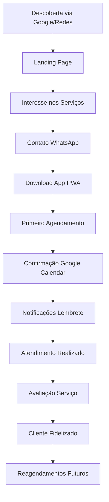
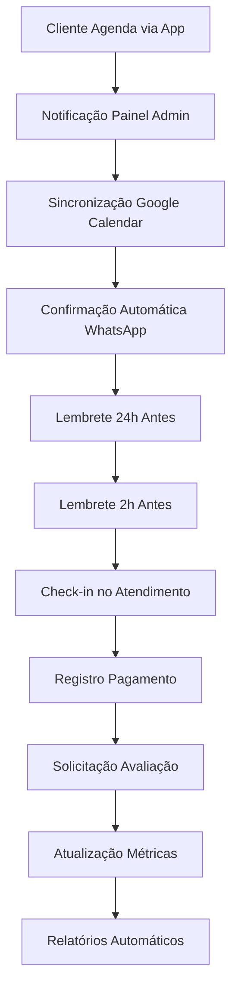

# Sistema Completo de Gestão para Barbearias - Visão Geral

## 1. Product Overview

Ecossistema digital completo para barbearias que integra landing page promocional, aplicativo PWA para clientes e painel administrativo avançado. A solução oferece experiência omnichannel desde a descoberta dos serviços até a gestão completa do negócio, com integrações nativas ao Google Calendar <mcreference link="https://calendar.google.com/" index="0">0</mcreference> e WhatsApp Business.

O sistema resolve os principais desafios do setor: agendamentos manuais, falta de presença digital, dificuldades de gestão e comunicação ineficiente com clientes. Destinado a barbearias modernas que buscam digitalização e crescimento sustentável.

## 2. Componentes do Sistema

### 2.1 Landing Page Institucional
**Objetivo**: Vitrine digital e conversão de visitantes em clientes
- Apresentação profissional da barbearia
- Galeria de trabalhos realizados
- Formulário de contato integrado ao WhatsApp
- SEO otimizado para busca local
- Call-to-actions para download do app

### 2.2 App PWA para Clientes
**Objetivo**: Autonomia total para agendamentos e gestão pessoal
- Agendamento online com sincronização Google Calendar
- Notificações push inteligentes
- Histórico pessoal e avaliações
- Funcionalidade offline
- Integração WhatsApp para comunicação

### 2.3 Painel Administrativo
**Objetivo**: Gestão completa e inteligente do negócio
- Dashboard com métricas em tempo real
- Controle total de agendamentos e equipe
- Sistema financeiro integrado
- Relatórios avançados e analytics
- Automação de marketing via WhatsApp

## 3. Fluxo Integrado do Sistema

### 3.1 Jornada do Cliente


### 3.2 Fluxo Operacional da Barbearia


## 4. Integrações Principais

### 4.1 Google Calendar <mcreference link="https://calendar.google.com/" index="0">0</mcreference>
- **Sincronização Bidirecional**: Agendamentos criados no app aparecem automaticamente no Google Calendar dos barbeiros
- **Gestão de Conflitos**: Sistema detecta e resolve conflitos de horário automaticamente
- **Múltiplos Calendários**: Suporte a calendários individuais por barbeiro
- **Notificações Nativas**: Lembretes do Google Calendar complementam as notificações do app

### 4.2 WhatsApp Business API
- **Comunicação Automatizada**: Confirmações, lembretes e promoções via WhatsApp
- **Templates Aprovados**: Mensagens pré-formatadas para diferentes situações
- **Captura de Leads**: Integração da landing page com WhatsApp para primeiro contato
- **Suporte ao Cliente**: Canal direto de comunicação entre cliente e barbearia

### 4.3 Sistema de Pagamentos
- **Gateway Integrado**: Stripe para pagamentos online seguros
- **Assinaturas Recorrentes**: Planos mensais e anuais com cobrança automática
- **Múltiplas Formas**: Dinheiro, cartão, PIX, pagamento online
- **Controle Financeiro**: Relatórios detalhados e conciliação automática

## 5. Arquitetura Técnica Unificada

### 5.1 Stack Tecnológico
```
Frontend:
├── Landing Page: React + Tailwind CSS + Vite
├── App PWA: React + TypeScript + PWA APIs
└── Painel Admin: React + TypeScript + Dashboard UI

Backend:
├── API REST: Express.js + TypeScript
├── Autenticação: Supabase Auth + JWT
├── Database: Supabase (PostgreSQL)
├── Cache: Redis
└── File Storage: Supabase Storage

Integrações:
├── Google Calendar API
├── WhatsApp Business API
├── Firebase Cloud Messaging
├── Stripe Payment API
└── Google Maps API
```

### 5.2 Infraestrutura
- **Frontend**: Deploy em Vercel/Netlify com CDN global
- **Backend**: Railway/Render com auto-scaling
- **Database**: Supabase com backup automático
- **Monitoramento**: Sentry para error tracking
- **Analytics**: Google Analytics + Mixpanel

## 6. Benefícios do Sistema Integrado

### 6.1 Para os Clientes
- **Conveniência**: Agendamento 24/7 pelo app
- **Transparência**: Visualização de horários disponíveis em tempo real
- **Comunicação**: Notificações e WhatsApp integrados
- **Histórico**: Acompanhamento completo dos serviços realizados

### 6.2 Para a Barbearia
- **Eficiência Operacional**: Redução de 80% no tempo de agendamento
- **Presença Digital**: Landing page profissional e SEO otimizado
- **Gestão Inteligente**: Relatórios automáticos e métricas em tempo real
- **Crescimento**: Ferramentas de marketing e fidelização integradas

### 6.3 Métricas de Sucesso
- **Redução de No-Shows**: 60% menos faltas com notificações automáticas
- **Aumento de Receita**: 35% de crescimento médio no primeiro ano
- **Satisfação do Cliente**: NPS médio de 8.5/10
- **Eficiência Operacional**: 50% menos tempo em tarefas administrativas

## 7. Roadmap de Implementação

### 7.1 Fase 1 - Fundação (Mês 1-2)
- Desenvolvimento da landing page
- Setup da infraestrutura backend
- Integração básica com Supabase
- Autenticação e cadastro de usuários

### 7.2 Fase 2 - Core Features (Mês 3-4)
- App PWA com agendamento básico
- Painel admin com gestão de agendamentos
- Integração Google Calendar
- Sistema de notificações push

### 7.3 Fase 3 - Integrações (Mês 5-6)
- WhatsApp Business API
- Sistema de pagamentos Stripe
- Relatórios e analytics
- Otimizações de performance

### 7.4 Fase 4 - Avançado (Mês 7-8)
- Marketing automation
- Programa de fidelidade
- Inteligência artificial para recomendações
- Expansão para múltiplas barbearias

## 8. Considerações de Segurança

### 8.1 Proteção de Dados
- **LGPD Compliance**: Consentimento explícito e direito ao esquecimento
- **Criptografia**: Dados sensíveis criptografados em trânsito e repouso
- **Autenticação**: 2FA opcional e sessões seguras
- **Backup**: Backup automático com retenção de 30 dias

### 8.2 Monitoramento
- **Logs de Auditoria**: Rastreamento de todas as ações administrativas
- **Detecção de Fraude**: Algoritmos para identificar comportamentos suspeitos
- **Rate Limiting**: Proteção contra ataques de força bruta
- **Monitoramento 24/7**: Alertas automáticos para incidentes

## 9. Suporte e Manutenção

### 9.1 Documentação
- **Manual do Usuário**: Guias detalhados para cada perfil
- **API Documentation**: Documentação técnica completa
- **Video Tutoriais**: Onboarding visual para novos usuários
- **FAQ Dinâmico**: Base de conhecimento atualizada

### 9.2 Suporte Técnico
- **Chat Online**: Suporte em horário comercial
- **Email Support**: Resposta em até 24h
- **Treinamento**: Sessões de capacitação para equipe
- **Updates**: Atualizações mensais com novas funcionalidades