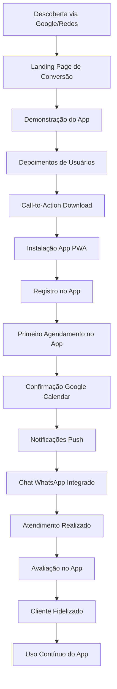
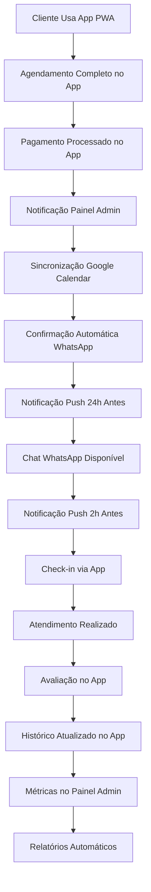

# Sistema de Gestão para Barbearias - Visão Geral

## 1. Introdução

O Sistema de Gestão para Barbearias é uma solução completa centrada em um **aplicativo PWA principal** onde estão todas as funcionalidades reais, complementado por uma **landing page de conversão** para aquisição de usuários e um **painel administrativo** para gestão do negócio.

## 2. Componentes do Sistema

### 2.1 Landing Page (Marketing/Conversão)
- **Propósito**: Página de conversão para promover o aplicativo
- **Funcionalidades**: Demonstração do app, depoimentos de usuários, call-to-action para download
- **Objetivo**: Converter visitantes em usuários do aplicativo PWA
- **Características**: Estática, focada em marketing, sem funcionalidades de agendamento

### 2.2 Aplicativo PWA (Coração do Sistema)
- **Propósito**: **Plataforma central com TODAS as funcionalidades**
- **Funcionalidades**: Agendamento completo, pagamentos, chat WhatsApp, notificações, gestão de perfil
- **Objetivo**: Oferecer experiência completa de agendamento e gestão para clientes
- **Características**: PWA instalável, offline-first, notificações push, integrações completas

### 2.3 Painel Administrativo (Gestão)
- **Propósito**: Gestão completa do negócio e monitoramento do app
- **Funcionalidades**: Controle de agendamentos, clientes, serviços, financeiro, configurações
- **Objetivo**: Administrar todas as operações geradas pelo app PWA
- **Características**: Interface web, relatórios avançados, integrações administrativas

## 3. Fluxo Integrado do Sistema

### 3.1 Jornada de Conversão (Landing → App)



### 3.2 Fluxo Operacional Centrado no App



## 4. Integrações Principais

### 4.1 Google Calendar <mcreference link="https://calendar.google.com/" index="0">0</mcreference>

* **Sincronização Bidirecional**: Agendamentos criados no app aparecem automaticamente no Google Calendar dos barbeiros

* **Gestão de Conflitos**: Sistema detecta e resolve conflitos de horário automaticamente

* **Múltiplos Calendários**: Suporte a calendários individuais por barbeiro

* **Notificações Nativas**: Lembretes do Google Calendar complementam as notificações do app

### 4.2 WhatsApp Business API

* **Comunicação Automatizada**: Confirmações, lembretes e promoções via WhatsApp

* **Templates Aprovados**: Mensagens pré-formatadas para diferentes situações

* **Captura de Leads**: Integração da landing page com WhatsApp para primeiro contato

* **Suporte ao Cliente**: Canal direto de comunicação entre cliente e barbearia

### 4.3 Sistema de Pagamentos

* **Gateway Integrado**: Stripe para pagamentos online seguros

* **Assinaturas Recorrentes**: Planos mensais e anuais com cobrança automática

* **Múltiplas Formas**: Dinheiro, cartão, PIX, pagamento online

* **Controle Financeiro**: Relatórios detalhados e conciliação automática

## 5. Arquitetura Técnica Unificada

### 5.1 Stack Tecnológico

```
Frontend:
├── Landing Page: React + Tailwind CSS + Vite
├── App PWA: React + TypeScript + PWA APIs
└── Painel Admin: React + TypeScript + Dashboard UI

Backend:
├── API REST: Express.js + TypeScript
├── Autenticação: Supabase Auth + JWT
├── Database: Supabase (PostgreSQL)
├── Cache: Redis
└── File Storage: Supabase Storage

Integrações:
├── Google Calendar API
├── WhatsApp Business API
├── Firebase Cloud Messaging
├── Stripe Payment API
└── Google Maps API
```

### 5.2 Infraestrutura

* **Frontend**: Deploy em Vercel/Netlify com CDN global

* **Backend**: Railway/Render com auto-scaling

* **Database**: Supabase com backup automático

* **Monitoramento**: Sentry para error tracking

* **Analytics**: Google Analytics + Mixpanel

## 6. Benefícios do Sistema Integrado

### 6.1 Para os Clientes (Via App PWA)

* **Conveniência Total**: Agendamento completo 24/7 pelo app com todas as funcionalidades

* **Experiência Nativa**: App instalável com funcionalidades offline e notificações push

* **Pagamento Integrado**: Processamento seguro de pagamentos direto no app

* **Comunicação Direta**: Chat WhatsApp integrado para suporte imediato

* **Histórico Completo**: Acompanhamento total dos serviços no próprio app

### 6.2 Para a Barbearia

* **Aquisição de Clientes**: Landing page otimizada para conversão em usuários do app

* **Operação Centralizada**: Todas as funcionalidades concentradas no app PWA

* **Gestão Inteligente**: Painel admin para monitorar e gerenciar operações do app

* **Crescimento Sustentável**: Funil de conversão landing → app → cliente fidelizado

### 6.3 Métricas de Sucesso

* **Redução de No-Shows**: 60% menos faltas com notificações automáticas

* **Aumento de Receita**: 35% de crescimento médio no primeiro ano

* **Satisfação do Cliente**: NPS médio de 8.5/10

* **Eficiência Operacional**: 50% menos tempo em tarefas administrativas

## 7. Roadmap de Implementação

### 7.1 Fase 1 - Fundação (Mês 1-2)

* Desenvolvimento da landing page

* Setup da infraestrutura backend

* Integração básica com Supabase

* Autenticação e cadastro de usuários

### 7.2 Fase 2 - Core Features (Mês 3-4)

* App PWA com agendamento básico

* Painel admin com gestão de agendamentos

* Integração Google Calendar

* Sistema de notificações push

### 7.3 Fase 3 - Integrações (Mês 5-6)

* WhatsApp Business API

* Sistema de pagamentos Stripe

* Relatórios e analytics

* Otimizações de performance

### 7.4 Fase 4 - Avançado (Mês 7-8)

* Marketing automation

* Programa de fidelidade

* Inteligência artificial para recomendações

* Expansão para múltiplas barbearias

## 8. Considerações de Segurança

### 8.1 Proteção de Dados

* **LGPD Compliance**: Consentimento explícito e direito ao esquecimento

* **Criptografia**: Dados sensíveis criptografados em trânsito e repouso

* **Autenticação**: 2FA opcional e sessões seguras

* **Backup**: Backup automático com retenção de 30 dias

### 8.2 Monitoramento

* **Logs de Auditoria**: Rastreamento de todas as ações administrativas

* **Detecção de Fraude**: Algoritmos para identificar comportamentos suspeitos

* **Rate Limiting**: Proteção contra ataques de força bruta

* **Monitoramento 24/7**: Alertas automáticos para incidentes

## 9. Suporte e Manutenção

### 9.1 Documentação

* **Manual do Usuário**: Guias detalhados para cada perfil

* **API Documentation**: Documentação técnica completa

* **Video Tutoriais**: Onboarding visual para novos usuários

* **FAQ Dinâmico**: Base de conhecimento atualizada

### 9.2 Suporte Técnico

* **Chat Online**: Suporte em horário comercial

* **Email Support**: Resposta em até 24h

* **Treinamento**: Sessões de capacitação para equipe

* **Updates**: Atualizações mensais com novas funcionalidades

